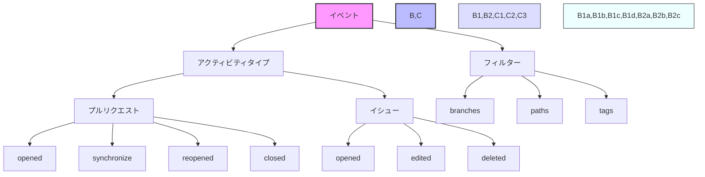

# GitHub Actions のイベントアクティビティタイプとフィルター



> 詳細は[公式ドキュメント: Events that trigger workflows](https://docs.github.com/en/actions/using-workflows/events-that-trigger-workflows)を参照してください。

GitHub Actionsのワークフローをより細かく制御するために、イベントのアクティビティタイプとフィルターを使用することで、特定の条件下でのみワークフローを実行することができます。

## イベントアクティビティタイプとは

イベントアクティビティタイプは、GitHub上で発生する特定のアクション（例：プルリクエストの作成、レビューの提出など）を指定するためのものです。これにより、ワークフローの実行タイミングをより正確に制御できます。

## 主なアクティビティタイプの例

### プルリクエスト関連
- `opened`: プルリクエストが作成された時
- `synchronize`: プルリクエストに新しいコミットがプッシュされた時
- `reopened`: プルリクエストが再オープンされた時
- `closed`: プルリクエストがクローズされた時
- `review_requested`: レビューが要求された時
- `review_request_removed`: レビュー要求が取り消された時

### イシュー関連
- `opened`: イシューが作成された時
- `edited`: イシューが編集された時
- `deleted`: イシューが削除された時
- `transferred`: イシューが別のリポジトリに転送された時
- `pinned`: イシューがピン留めされた時
- `unpinned`: イシューのピン留めが解除された時

## フィルターの使用方法

フィルターを使用することで、特定の条件に基づいてワークフローの実行を制限できます。

### 基本的なフィルター構文
```yaml
on:
  pull_request:
    types: [opened, synchronize]
    branches:
      - main
      - develop
```

### よく使用されるフィルター
- `branches`: 特定のブランチでのみ実行
- `paths`: 特定のファイルパスが変更された時のみ実行
- `tags`: 特定のタグが付いた時のみ実行

## 実践的な例

```yaml
name: Pull Request Workflow

on:
  pull_request:
    types: [opened, synchronize]
    branches:
      - main
    paths:
      - 'src/**'
      - 'tests/**'
```

この例では：
- プルリクエストが作成または更新された時
- mainブランチに対して
- src/またはtests/ディレクトリ内のファイルが変更された場合のみ
ワークフローが実行されます。

## 注意点
- フィルターは複数組み合わせることができます
- パスフィルターは変更されたファイルのパスに基づいて実行を制御します
- ブランチフィルターは、プルリクエストのベースブランチに基づいて実行を制御します
