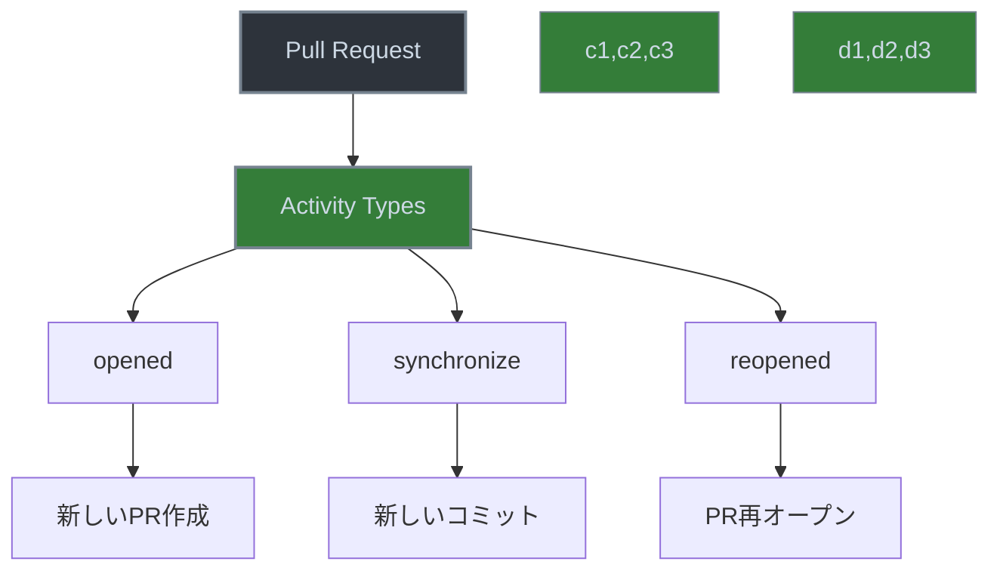

# GitHub Actions の activity types について



> 詳細は[公式ドキュメント: Events that trigger workflows](https://docs.github.com/en/actions/using-workflows/events-that-trigger-workflows)を参照してください。

GitHub Actions の activity types は、特定のイベントが発生した際にワークフローをトリガーする条件を細かく制御するための重要な機能です。

## 概要

activity types は、イベントが発生した際の具体的なアクションの種類を指定することで、ワークフローをより細かく制御することができます。例えば、`pull_request` イベントの場合、デフォルトでは `opened`、`synchronize`、`reopened` の3つの activity types のみがトリガーとなります。

## 主な activity types の例

### pull_request イベントの場合
- `opened`: 新しい pull request が作成された時
- `synchronize`: pull request に新しいコミットがプッシュされた時
- `reopened`: クローズされた pull request が再オープンされた時

## 使用例

```yaml
on:
  pull_request:
    types: [opened, synchronize, reopened]
```

このように設定することで、指定した activity types の時のみワークフローが実行されます。デフォルトの動作を変更したい場合は、`types` キーを使用して明示的に指定する必要があります。

## 注意点

- activity types は、イベントごとに異なる種類が用意されています
- デフォルトの動作を理解し、必要に応じて適切な activity types を指定することが重要です
- 公式ドキュメントで各イベントの activity types を確認することができます
