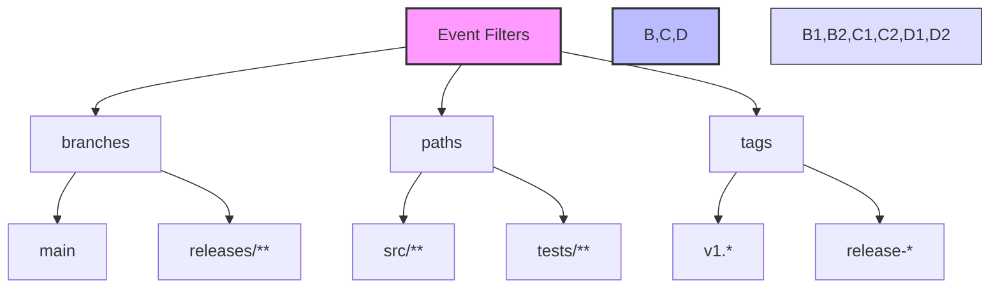

# Event Filters



> 詳細は[公式ドキュメント: Filter pattern cheat sheet](https://docs.github.com/en/actions/using-workflows/workflow-syntax-for-github-actions#filter-pattern-cheat-sheet)を参照してください。

GitHub Actionsのワークフローをより細かく制御するために、特定の条件に基づいてワークフローの実行を制限することができます。

Event Filtersは、ワークフローの実行を特定の条件に基づいて制限するための設定です。

## branches

`branches`フィルターは、特定のブランチでのみワークフローを実行するために使用されます。

```yaml
on:
  push:
    branches:
      - main
      - 'releases/**'
```

この例では、`main`ブランチと`releases/`で始まるブランチへのプッシュ時にのみワークフローが実行されます。

## paths

`paths`フィルターは、特定のファイルやディレクトリが変更された場合にのみワークフローを実行するために使用されます。

```yaml
on:
  push:
    paths:
      - 'src/**'
      - 'tests/**'
```

この例では、`src/`ディレクトリまたは`tests/`ディレクトリ内のファイルが変更された場合にのみワークフローが実行されます。

## 注意点

- `paths`フィルターは、ファイルの変更を検出するために使用されますが、ファイルの内容の変更は検出しません。
- `branches`と`paths`フィルターは組み合わせて使用することができます。
- フィルターの条件に一致しない場合、ワークフローは実行されません。
