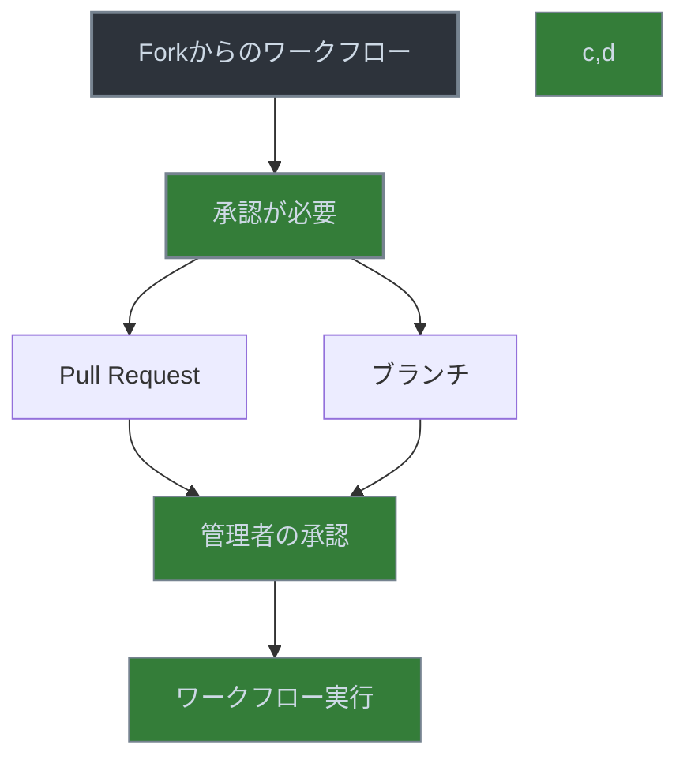

# GitHub Actions の Fork における特別な動作



> 詳細は[公式ドキュメント: Approving workflow runs from public forks](https://docs.github.com/en/actions/managing-workflow-runs-and-deployments/managing-workflow-runs/approving-workflow-runs-from-public-forks)を参照してください。

GitHub Actions では、fork されたリポジトリからのワークフロー実行には特別な制限が設けられています。これは、セキュリティを確保するための重要な機能です。

## Fork からのワークフロー実行における承認（Approval）要件

fork されたリポジトリからワークフローを実行する場合、セキュリティ上の理由から、リポジトリの管理者による明示的な承認（Approval）が必要となります。これは、悪意のあるコードの実行を防ぐための重要なセキュリティ対策です。

### 承認が必要なケース
1. フォークされたリポジトリからの Pull Request でワークフローを実行する場合
   ```yaml
   on:
     pull_request:
       branches: [ main ]
   ```

2. フォークされたリポジトリのブランチからワークフローを実行する場合
   ```yaml
   on:
     push:
       branches: [ main ]
   ```

### 承認の設定方法

1. リポジトリの設定（Settings）に移動
2. Actions > General を選択
3. "Fork pull request workflows from outside collaborators" セクションで以下の設定を構成：
   - Require approval for first-time contributors
   - Require approval for all outside collaborators

### 承認の流れ

1. フォークからの Pull Request が作成される
2. ワークフローが実行されようとする
3. リポジトリ管理者に承認リクエストが送られる
4. 管理者が承認すると、ワークフローが実行される

## 重要な注意点

1. セキュリティ上の制限
   - `pull_request` イベントのフィルター条件（ブランチ名、ラベル、レビュー状態など）がすべて合致していても、fork からの場合は必ず承認が必要です
   - これは、ワークフローの設定や条件に関係なく、fork からの実行には常に承認が必要ということを意味します

2. ワークフローの実行制限
   - フォークからのワークフローは、デフォルトで読み取り専用の権限で実行されます
   - 機密情報（secrets）へのアクセスは制限されます
   - 書き込み権限が必要な操作は実行できません

3. ベストプラクティス
   - フォークからの Pull Request に対しては、必要最小限のワークフローのみを実行するように設定する
   - 機密情報を使用するワークフローは、フォークからの実行を制限する
   - 承認プロセスを明確に文書化し、コントリビューターに周知する

## 実践的な設定例

### フォークからの Pull Request 用のワークフロー
```yaml
name: Fork PR Workflow

on:
  pull_request:
    branches: [ main ]

jobs:
  test:
    runs-on: ubuntu-latest
    steps:
      - uses: actions/checkout@v3
      - name: Run tests
        run: npm test
```

### メインリポジトリ用のワークフロー
```yaml
name: Main Repository Workflow

on:
  pull_request:
    branches: [ main ]

jobs:
  test:
    runs-on: ubuntu-latest
    steps:
      - uses: actions/checkout@v3
      - name: Run tests
        run: npm test
      - name: Deploy
        if: github.event.pull_request.merged == true
        run: npm run deploy
```

このように、フォークからの Pull Request とメインリポジトリの Pull Request で異なるワークフローを設定することで、セキュリティを確保しながら効率的な開発フローを実現できます。
