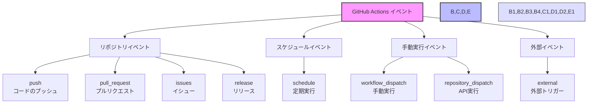

# GitHub Actionsのイベント



> 詳細は[公式ドキュメント: Events that trigger workflows](https://docs.github.com/en/actions/using-workflows/events-that-trigger-workflows)を参照してください。

GitHub Actionsでは、ワークフローを実行するきっかけとなる様々なイベントを設定することができます。これらのイベントを理解することで、自動化のタイミングを適切に制御できます。

## 主なイベントの種類と使い方

### 1. リポジトリイベント
リポジトリ内で発生するアクションに応じてワークフローを実行します。

- `push`: コードがプッシュされたとき
  ```yaml
  on:
    push:
      branches: [ main, develop ]  # 特定のブランチへのプッシュ時のみ実行
  ```

- `pull_request`: プルリクエストが作成、更新、マージされたとき
  ```yaml
  on:
    pull_request:
      types: [opened, synchronize]  # プルリクエストの作成と更新時のみ実行
  ```

- `issues`: イシューが作成、更新、クローズされたとき
  ```yaml
  on:
    issues:
      types: [opened, closed]  # イシューの作成とクローズ時のみ実行
  ```

- `release`: リリースが作成、更新、削除されたとき
  ```yaml
  on:
    release:
      types: [published]  # リリースが公開された時のみ実行
  ```

### 2. スケジュールイベント
定期的なタスクを自動実行する場合に使用します。

- `schedule`: cron形式で指定した時間に実行
  ```yaml
  on:
    schedule:
      - cron: '0 0 * * *'  # 毎日0時に実行
      - cron: '0 12 * * 1-5'  # 平日の12時に実行
  ```

### 3. 手動実行イベント
必要なタイミングで手動でワークフローを実行する場合に使用します。

- `workflow_dispatch`: GitHubのUIから手動で実行
  ```yaml
  on:
    workflow_dispatch:
      inputs:
        environment:
          description: 'デプロイ環境'
          required: true
          default: 'staging'
  ```

- `repository_dispatch`: APIから外部から実行をトリガー
  ```yaml
  on:
    repository_dispatch:
      types: [deploy_request]
  ```

### 4. 外部イベント
外部サービスからの通知に応じてワークフローを実行する場合に使用します。

- `external`: 外部サービスからのWebhookを受け取ったとき
  ```yaml
  on:
    external:
      types: [deployment]
  ```

## 実践的な使用例

### 開発フローでの使用例
```yaml
name: 開発フロー自動化

on:
  # プルリクエスト時のテスト実行
  pull_request:
    branches: [ main, develop ]
    paths:
      - 'src/**'
      - 'tests/**'

  # メインブランチへのマージ時のデプロイ
  push:
    branches: [ main ]
    paths:
      - 'src/**'

  # 毎日の定時テスト実行
  schedule:
    - cron: '0 0 * * *'
```

## 重要なポイント

1. 複数のイベントを組み合わせることで、より柔軟な自動化が可能です
2. イベントごとに実行条件を細かく設定することで、不要な実行を防げます
3. パスフィルターを使用することで、特定のファイルが変更された時のみ実行できます
4. 手動実行イベントでは、実行時にパラメータを渡すことができます

## ベストプラクティス

1. 必要最小限のイベントのみを設定する
2. ブランチやパスのフィルターを適切に使用する
3. スケジュールイベントは慎重に設定する（リソース消費に注意）
4. 手動実行イベントには適切なパラメータを設定する
