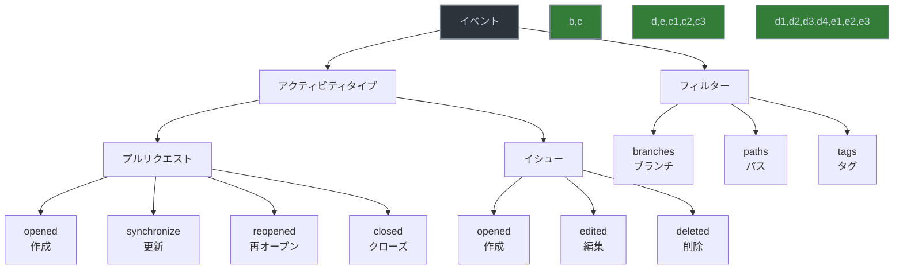

# GitHub Actions のイベントアクティビティタイプとフィルター



> 詳細は[公式ドキュメント: Events that trigger workflows](https://docs.github.com/en/actions/using-workflows/events-that-trigger-workflows)を参照してください。

GitHub Actionsのワークフローをより細かく制御するために、イベントのアクティビティタイプとフィルターを使用することで、特定の条件下でのみワークフローを実行することができます。

## アクティビティタイプとは

アクティビティタイプは、GitHub上で発生する特定のアクションを指定するためのものです。これにより、ワークフローの実行タイミングをより正確に制御できます。

## 主なアクティビティタイプの例

### プルリクエスト関連
```yaml
on:
  pull_request:
    types:
      - opened      # プルリクエストが作成された時
      - synchronize # プルリクエストに新しいコミットがプッシュされた時
      - reopened    # プルリクエストが再オープンされた時
      - closed      # プルリクエストがクローズされた時
      - review_requested      # レビューが要求された時
      - review_request_removed # レビュー要求が取り消された時
```

### イシュー関連
```yaml
on:
  issues:
    types:
      - opened     # イシューが作成された時
      - edited     # イシューが編集された時
      - deleted    # イシューが削除された時
      - transferred # イシューが別のリポジトリに転送された時
      - pinned     # イシューがピン留めされた時
      - unpinned   # イシューのピン留めが解除された時
```

## フィルターの使用方法

フィルターを使用することで、特定の条件に基づいてワークフローの実行を制限できます。

### ブランチフィルター
```yaml
on:
  push:
    branches:
      - main        # mainブランチへのプッシュ時のみ実行
      - 'releases/*' # releases/で始まるブランチへのプッシュ時のみ実行
```

### パスフィルター
```yaml
on:
  pull_request:
    paths:
      - 'src/**'    # srcディレクトリ内のファイルが変更された時のみ実行
      - 'tests/**'  # testsディレクトリ内のファイルが変更された時のみ実行
      - '*.md'      # マークダウンファイルが変更された時のみ実行
```

### タグフィルター
```yaml
on:
  push:
    tags:
      - 'v*'        # vで始まるタグがプッシュされた時のみ実行
      - 'release-*' # release-で始まるタグがプッシュされた時のみ実行
```

## 実践的な例

### 開発フローでの使用例
```yaml
name: 開発フロー自動化

on:
  pull_request:
    types: [opened, synchronize]
    branches:
      - main
      - develop
    paths:
      - 'src/**'
      - 'tests/**'
      - 'package.json'
      - 'yarn.lock'

  push:
    branches:
      - main
    paths:
      - 'src/**'
    tags:
      - 'v*'
```

この例では：
1. プルリクエストが作成または更新された時
2. mainまたはdevelopブランチに対して
3. ソースコード、テスト、パッケージ設定ファイルが変更された場合
4. メインブランチへのプッシュで、ソースコードが変更された場合
5. バージョンタグがプッシュされた場合
にワークフローが実行されます。

## 注意点とベストプラクティス

1. フィルターは複数組み合わせることができます
2. パスフィルターは変更されたファイルのパスに基づいて実行を制御します
3. ブランチフィルターは、プルリクエストのベースブランチに基づいて実行を制御します
4. タグフィルターは、正確なタグ名のパターンマッチングを行います
5. 不要なフィルターは設定しない（パフォーマンスに影響する可能性があります）
6. フィルターの条件は明確に記述する（メンテナンス性の向上）
