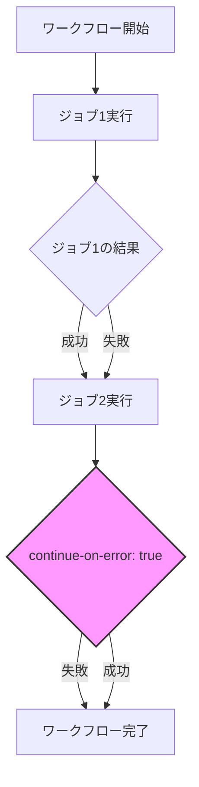
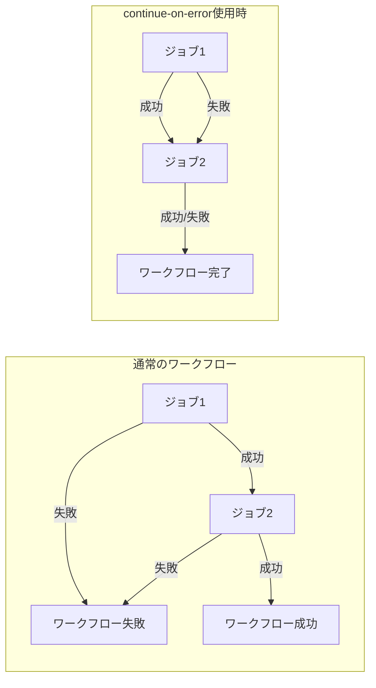
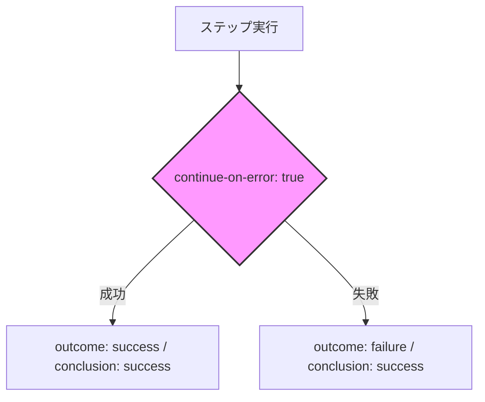

# continue-on-error

GitHub Actionsのワークフロー実行において、特定のジョブやステップが失敗した場合でもワークフローを継続させるための重要な機能です。

## 概要

`continue-on-error`は、ジョブやステップが失敗した場合でもワークフローを中断せずに続行することを可能にする設定です。これは、特定のタスクの失敗が全体のワークフローに影響を与えないようにしたい場合に特に有用です。

## 基本的な使い方

### ジョブレベルでの設定
```yaml
jobs:
  job1:
    continue-on-error: true
    steps:
      - name: 失敗しても続行するジョブ
        run: |
          # コマンド
```

### ステップレベルでの設定
```diff yaml
jobs:
  job1:
    steps:
      - name: 失敗しても続行するステップ
+       continue-on-error: true
        run: |
          # コマンド
```

## 動作の仕組み

### 実行フロー


### 通常のワークフローとの比較


## 実行結果の解釈

### outcomeとconclusionの違い（公式ドキュメントの文脈）

- **outcome**
  - `continue-on-error`が適用される**前**の、ステップの実際の実行結果です。
  - 取りうる値: `success`, `failure`, `cancelled`, `skipped`
  - 例: `continue-on-error`なステップが失敗した場合、`outcome`は`failure`になります。

- **conclusion**
  - `continue-on-error`が適用された**後**の、ステップの最終的な結果です。
  - 取りうる値: `success`, `failure`, `cancelled`, `skipped`
  - 例: `continue-on-error`なステップが失敗しても、最終的な`conclusion`は`success`になります。

#### 公式ドキュメントの説明（要約）
- `outcome`は「continue-on-error適用前」の結果
- `conclusion`は「continue-on-error適用後」の結果

#### 例
- あるステップが失敗し、`continue-on-error: true`が設定されている場合：
  - `outcome`: `failure`
  - `conclusion`: `success`



## 使用上の注意点

- `continue-on-error: true`を設定したジョブやステップが失敗しても、ワークフローは続行されます
- 失敗したジョブやステップは、GitHub Actionsの実行結果で「失敗」としてマークされます
- 依存関係のあるジョブがある場合、`needs`キーワードを使用して適切に設定する必要があります

## 実践的な使用例

```yaml
name: テストとデプロイ

on: [push]

jobs:
  test:
    runs-on: ubuntu-latest
    steps:
      - name: テスト実行
        run: npm test

  deploy:
    needs: test
    continue-on-error: true
    runs-on: ubuntu-latest
    steps:
      - name: デプロイ
        run: |
          # デプロイコマンド
```

この例では、デプロイジョブが失敗してもワークフローは完了としてマークされます。これは、テストが成功した後、デプロイに問題が発生した場合でも、ワークフローの実行結果を確認できるようにするためです。

## 公式ドキュメント

- [continue-on-error の詳細な説明](https://docs.github.com/ja/actions/using-workflows/workflow-syntax-for-github-actions#jobsjob_idcontinue-on-error)
