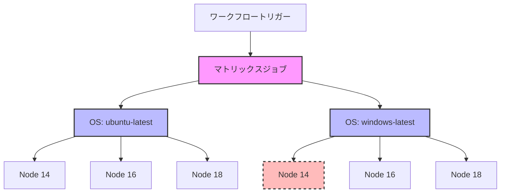

# Matrix Strategies（マトリックス戦略）

GitHub Actionsのマトリックス戦略は、異なる変数の組み合わせでジョブを実行できる機能で、複数の環境や設定で効率的に並列テストを実行することができます。

## 概要

マトリックス戦略は、変数の異なる値の組み合わせを使用して複数のジョブを作成し、ワークフローの定義を重複させることなく並列実行できる強力な機能です。

## 主要な概念

- **Matrix（マトリックス）**: 変数の異なる値の組み合わせで複数のジョブを作成する設定
- **Strategy（戦略）**: マトリックスの実行方法と失敗時の処理方法を定義する
- **Fail-fast（フェイルファスト）**: いずれかのジョブが失敗した場合にすべてのジョブを停止する戦略オプション
- **Max-parallel（最大並列数）**: 同時に実行できるジョブの数を制限する
- **Continue-on-error（エラー継続）**: 特定のジョブが失敗してもワークフローを継続する設定

## 重要なポイント

- マトリックス戦略は、類似したジョブを統合することでワークフローの保守性を向上させます
- 以下のような複数の環境でのテストに特に有用です：
  - オペレーティングシステム
  - プログラミング言語のバージョン
  - Node.jsのバージョン
  - データベースのバージョン
  - ブラウザのバージョン
- 特定の環境やバージョンでのテストが失敗しても、他のテストを継続したい場合は`continue-on-error`を使用できます

## 設定例

```yaml
jobs:
  test:
    strategy:
      matrix:
        os: [ubuntu-latest, windows-latest]
        node: [14, 16, 18]
        fail-fast: true
        max-parallel: 2
    runs-on: ${{ matrix.os }}
    continue-on-error: ${{ matrix.os == 'windows-latest' && matrix.node == '14' }}
    steps:
      - uses: actions/setup-node@v3
        with:
          node-version: ${{ matrix.node }}
```

## 視覚的な表現



## 公式ドキュメント

- [GitHub Actions Matrix Strategy Documentation](https://docs.github.com/en/actions/using-jobs/using-a-matrix-for-your-jobs)
- [GitHub Actions Matrix Syntax](https://docs.github.com/en/actions/using-workflows/workflow-syntax-for-github-actions#jobsjob_idstrategymatrix)
- [GitHub Actions Continue-on-error](https://docs.github.com/en/actions/using-workflows/workflow-syntax-for-github-actions#jobsjob_idcontinue-on-error)
