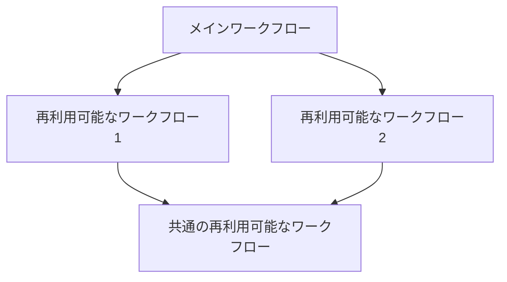

# GitHub Actions の再利用可能なワークフロー

## 概要

GitHub Actionsでは、ワークフローを再利用可能なコンポーネントとして定義し、他のワークフローから呼び出すことができます。これにより、コードの重複を避け、メンテナンス性を向上させることができます。

## 再利用可能なワークフローの基本構造

再利用可能なワークフローは、`.github/workflows` ディレクトリ内のYAMLファイルとして定義します。以下のような構造になります：

```yaml
# .github/workflows/reusable-workflow.yml
name: Reusable Workflow

on:
  workflow_call:

jobs:
  reusable-job:
    runs-on: ubuntu-latest
    steps:
      - name: Reusable step
        run: echo "This is a reusable workflow"
```

## 相対パスを使用したワークフローの呼び出し

再利用可能なワークフローを呼び出す際に、相対パスを使用することができます。以下のような構造を例に説明します：



### ディレクトリ構造の例

```
.github/
  workflows/
    main-workflow.yml
    reusable/
      workflow1.yml
      workflow2.yml
      common-workflow.yml
```

### 相対パスを使用した呼び出し例

```yaml
# .github/workflows/main-workflow.yml
name: Main Workflow

on:
  push:
    branches: [ main ]

jobs:
  call-workflow1:
    uses: ./.github/workflows/reusable/workflow1.yml

  call-workflow2:
    uses: ./.github/workflows/reusable/workflow2.yml
```

## 相対パスの指定方法

相対パスを指定する際の重要なポイント：

1. パスは `.github/workflows` ディレクトリからの相対パスで指定します
2. パスの先頭に `./` を付けることで、明示的に相対パスであることを示します
3. ディレクトリの区切りには `/` を使用します

## ベストプラクティス

1. **明確なディレクトリ構造**
   - 再利用可能なワークフローは専用のディレクトリにまとめる
   - 命名規則を統一する

2. **ワークフローの設計**
   - 単一の責任を持つワークフローを作成する
   - 共通の処理は別のワークフローとして切り出す

3. **セキュリティ**
   - 必要最小限の権限を設定する

4. **ドキュメント化**
   - ワークフローの目的と使用方法を明確に記述する

## 注意点

1. 相対パスは `.github/workflows` ディレクトリからの相対パスである必要があります
2. ワークフローファイルの名前は一意である必要があります
3. 循環参照を避ける必要があります

## まとめ

再利用可能なワークフローを相対パスで呼び出すことで、コードの再利用性と保守性を向上させることができます。適切なディレクトリ構造と命名規則を設定し、明確なドキュメントとともに使用することで、効率的なワークフロー管理が可能になります。
