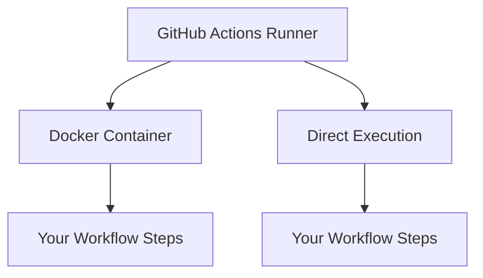

# GitHub Actions のランナーとコンテナ

## 概要

GitHub Actionsのワークフローは必ずランナー上で実行され、コンテナはそのランナー上で動作します。

## 実行環境の階層



## ランナー（Runner）

- ワークフローの実行環境を提供
- 物理的なマシンまたは仮想マシン
- GitHubが提供するホスト型ランナー
- セルフホストランナー（自分で用意）

## コンテナ（Container）

- ランナー上で実行される
- 分離された環境を提供
- 特定のバージョンや環境を指定可能
- オプションとして使用

## 実行パターン

### 1. ランナー上で直接実行

```yaml
jobs:
  direct:
    runs-on: ubuntu-latest
    steps:
      - name: Direct execution
        run: echo "Running directly on runner"
```

### 2. コンテナ内で実行

```yaml
jobs:
  container:
    runs-on: ubuntu-latest
    container:
      image: node:18
    steps:
      - name: Container execution
        run: echo "Running in container"
```

## 注意点

1. ランナーの指定（`runs-on`）は必須
2. コンテナの使用は任意
3. コンテナを使用する場合、ランナーにDockerが必要
4. コンテナ内のファイルシステムは分離される
5. コンテナを使用しない場合、ランナーの環境を直接使用 
