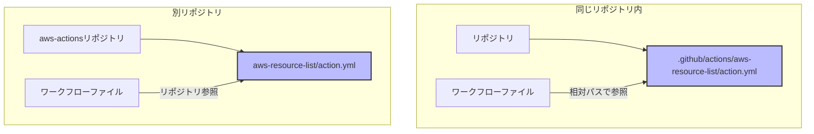

# Composite Actionsの作成場所と使用方法

## 概要
Composite Actionsは、同じリポジトリ内の`.github/actions`ディレクトリに作成する方法と、別のパブリックリポジトリに作成する方法があります。それぞれの方法には利点があり、用途に応じて選択できます。

## 主要概念
Composite Actionsの作成場所は、再利用性やメンテナンス性に影響します。同じリポジトリ内に作成する場合は相対パスで参照でき、別リポジトリに作成する場合は他のプロジェクトでも利用可能になります。

## 視覚化
以下は、Composite Actionsの作成場所と参照方法を示すmermaid図です：



## 実装例

### 1. 同じリポジトリ内に作成する場合

```yaml
# .github/actions/aws-resource-list/action.yml
name: 'AWS Resource List'
description: 'Lists AWS resources'
inputs:
  aws-region:
    description: 'AWS region to use'
    required: true
    default: 'ap-northeast-1'
runs:
  using: "composite"
  steps:
    - name: checkout
      uses: actions/checkout@v3
    - name: configure-aws
      uses: aws-actions/configure-aws-credentials@v2
      with:
        aws-region: ${{ inputs.aws-region }}
    - name: list-buckets
      run: aws s3 ls
      shell: bash
```

使用例：
```yaml
# .github/workflows/main.yml
name: List Resources
on: [push]
jobs:
  list-resources:
    runs-on: ubuntu-latest
    steps:
      - uses: ./.github/actions/aws-resource-list
        with:
          aws-region: 'ap-northeast-1'
```

### 2. 別リポジトリに作成する場合

```yaml
# aws-actions/aws-resource-list/action.yml
name: 'AWS Resource List'
description: 'Lists AWS resources'
inputs:
  aws-region:
    description: 'AWS region to use'
    required: true
    default: 'ap-northeast-1'
runs:
  using: "composite"
  steps:
    - name: checkout
      uses: actions/checkout@v3
    - name: configure-aws
      uses: aws-actions/configure-aws-credentials@v2
      with:
        aws-region: ${{ inputs.aws-region }}
    - name: list-buckets
      run: aws s3 ls
      shell: bash
```

使用例：
```yaml
# .github/workflows/main.yml
name: List Resources
on: [push]
jobs:
  list-resources:
    runs-on: ubuntu-latest
    steps:
      - uses: your-org/aws-actions/aws-resource-list@v1
        with:
          aws-region: 'ap-northeast-1'
```

## 各方法のメリット・デメリット

### 同じリポジトリ内に作成する場合
メリット：
- 相対パスで簡単に参照可能
- リポジトリ固有の設定や処理を組み込みやすい
- バージョン管理が容易

デメリット：
- 他のリポジトリでの再利用が難しい
- リポジトリ間で同じ処理を共有できない

### 別リポジトリに作成する場合
メリット：
- 複数のリポジトリで再利用可能
- 共通の処理を一元管理できる
- バージョン管理による安定性の確保

デメリット：
- リポジトリの公開設定が必要
- バージョン管理の手間が増える
- リポジトリ固有の設定を組み込みにくい

## セキュリティ考慮事項
- パブリックリポジトリに作成する場合は、機密情報の取り扱いに注意
- アクションのバージョンは固定バージョン（例：`@v1`）を指定する
- サードパーティのアクションを使用する場合は、信頼できるソースからのものであることを確認する

## 参考資料
- [GitHub Actions公式ドキュメント - Composite Actions](https://docs.github.com/ja/actions/creating-actions/creating-a-composite-action)
- [GitHub Actionsのベストプラクティス](https://docs.github.com/ja/actions/learn-github-actions/security-hardening-for-github-actions) 
