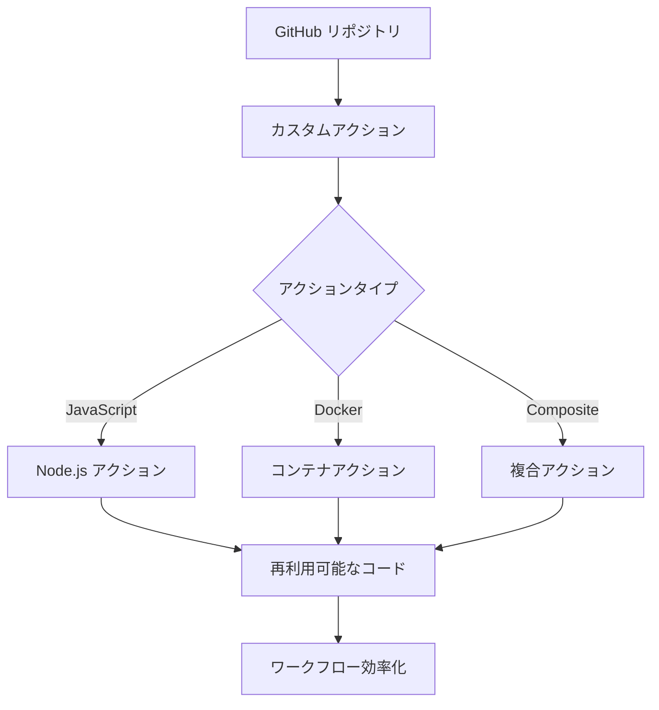

# カスタムアクションの重要性

## 概要
GitHub Actionsのカスタムアクションは、ワークフロー内で再利用可能なコードブロックを作成し、CI/CDプロセスの効率化と標準化を実現するための重要な機能です。複雑なステップを1つの呼び出しにまとめることでワークフローをシンプルにし、また、コミュニティに存在しない特殊な要件にも対応できる柔軟性を提供します。

## 主要概念
カスタムアクションは、特定のタスクを実行するための独立した再利用可能なコードユニットで、JavaScript、Docker、または複合アクションとして実装できます。これにより、チーム間でのコード共有や標準化されたプロセスの実現が可能になります。特に、複数のステップを1つにまとめることで、ワークフローの可読性と保守性が向上し、また、組織固有の要件や特殊な処理が必要な場合にも柔軟に対応できます。

## 実装例
```yaml
# カスタムアクションの使用例
name: Deploy Application
on: [push]
jobs:
  deploy:
    runs-on: ubuntu-latest
    steps:
      - uses: actions/checkout@v3
      - name: Deploy to Production
        uses: my-org/deploy-action@v1
        with:
          environment: production
          api-key: ${{ secrets.API_KEY }}
```

## 視覚化


## 主な利点
1. **再利用性**: 同じコードを複数のワークフローで再利用可能
2. **標準化**: チーム全体で一貫したプロセスを実現
3. **保守性**: コードの集中管理による保守性の向上
4. **セキュリティ**: 機密情報の安全な管理と共有
5. **ワークフローの簡素化**: 複雑なステップの集合を1つの呼び出しにまとめることで、ワークフローの可読性と保守性が向上
6. **独自要件への対応**: コミュニティに存在しない特殊な操作や、組織固有の要件に対応可能

## セキュリティ考慮事項
- アクションのバージョン管理（特定のコミットハッシュやタグの使用）
- 機密情報の適切な管理（GitHub Secretsの活用）
- サードパーティアクションの信頼性確認

## 参考資料
- [GitHub Actions公式ドキュメント](https://docs.github.com/ja/actions/creating-actions)
- [アクションの作成ガイド](https://docs.github.com/ja/actions/creating-actions/creating-a-javascript-action)
