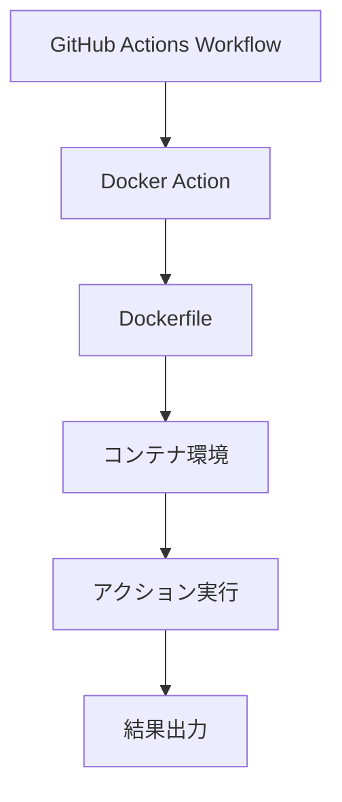

# Docker Actions

Docker Actionsは、GitHub Actionsでカスタムアクションを作成する際に、Dockerコンテナを使用して実行環境を完全に制御できる方法です。特に複雑な依存関係や特定の環境設定が必要な場合に有効です。

## 主要概念

Docker Actionsは、Dockerfileを使用してカスタムアクションの実行環境を定義し、コンテナ内でアクションのコードを実行します。これにより、一貫性のある環境でアクションを実行でき、依存関係の管理が容易になります。

## 実装例

以下は、シンプルなDocker Actionの実装例です：

```dockerfile
# Dockerfile
FROM node:16

COPY entrypoint.sh /entrypoint.sh
RUN chmod +x /entrypoint.sh

ENTRYPOINT ["/entrypoint.sh"]
```

```yaml
# action.yml
name: 'Docker Action'
description: 'Dockerを使用したカスタムアクション'
inputs:
  input1:
    description: '入力パラメータ1'
    required: true
  input2:
    description: '入力パラメータ2'
    required: false
    default: 'default value'
runs:
  using: 'docker'
  image: 'Dockerfile'
```

```bash
#!/bin/bash
# entrypoint.sh
echo "Hello from Docker Action!"
echo "Input parameter: $1"
```

### Pythonでの入力パラメータの処理

Pythonを使用する場合の例：

```dockerfile
# Dockerfile
FROM python:3.9-slim

COPY action.py /action.py
RUN chmod +x /action.py

ENTRYPOINT ["python", "/action.py"]
```

```python
# action.py
import os
import sys

def main():
    # 入力パラメータは環境変数として渡される
    # action.ymlで定義したinput1は INPUT_INPUT1 として環境変数に設定される
    input1 = os.getenv('INPUT_INPUT1')
    input2 = os.getenv('INPUT_INPUT2', 'default value')  # デフォルト値の設定も可能

    print(f"Input1: {input1}")
    print(f"Input2: {input2}")

    # 処理の実行
    result = f"Processed: {input1} - {input2}"
    
    # 出力パラメータの設定
    # 出力パラメータは特定の形式で標準出力に書き込む必要がある
    print(f"::set-output name=result::{result}")

if __name__ == "__main__":
    main()
```

## 視覚化



## セキュリティ考慮事項

- Docker Actionを使用する際は、信頼できるベースイメージを使用する
- 必要最小限の権限でコンテナを実行する
- 機密情報はGitHub Secretsを使用して管理する
- 定期的にベースイメージを更新し、セキュリティパッチを適用する

## 参考資料

- [GitHub Actions のドキュメント](https://docs.github.com/ja/actions/creating-actions/creating-a-docker-container-action)
- [Docker 公式ドキュメント](https://docs.docker.com/)

