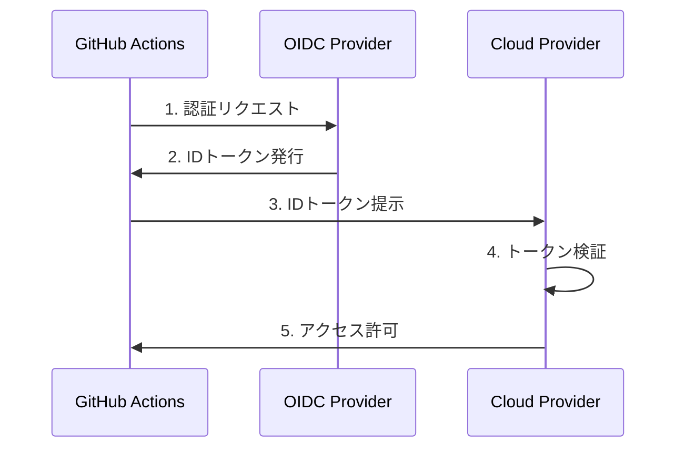

# GitHub ActionsにおけるOIDC（OpenID Connect）

## 概要
OIDCは、GitHub Actionsワークフローでクラウドリソースに安全にアクセスするための認証メカニズムです。長期的な認証情報を保存せずに、一時的な認証トークンを利用してセキュアなアクセスを実現します。

## 主要概念
OIDCは、IDトークンを使用した認証プロトコルで、ワークフローの実行時に自動的に発行される一時的な認証情報を提供します。これにより、シークレットの保存や管理のリスクを軽減できます。

## 実装例
以下は、AWSリソースにアクセスするためのOIDC設定例です：

```yaml
name: AWS OIDC Example
on:
  push:
    branches: [ main ]

permissions:
  id-token: write
  contents: read

jobs:
  deploy:
    runs-on: ubuntu-latest
    steps:
      - name: Configure AWS Credentials
        uses: aws-actions/configure-aws-credentials@v1
        with:
          role-to-assume: arn:aws:iam::123456789012:role/github-actions-role
          aws-region: ap-northeast-1
```

## セキュリティ考慮事項
- 最小権限の原則に従い、必要な権限のみを付与
- 信頼関係の設定は慎重に行い、適切な条件を設定
- トークンの有効期限を適切に設定
- 定期的な監査と権限の見直し

## 関連概念の視覚化

### OIDC認証フロー


### 信頼関係の設定


## 参考資料
- [GitHub Actions OIDC ドキュメント](https://docs.github.com/ja/actions/deployment/security-hardening-your-deployments/about-security-hardening-with-openid-connect)
- [AWS OIDC 設定ガイド](https://docs.aws.amazon.com/ja_jp/IAM/latest/UserGuide/id_roles_providers_create_oidc.html)
