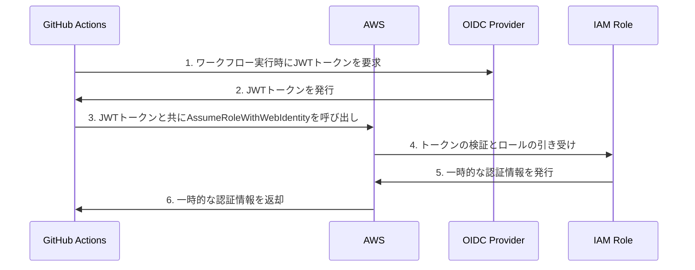

# AWS OIDC (OpenID Connect) による認証

AWS OIDCは、GitHub ActionsからAWSリソースに安全にアクセスするための最新の認証方式です。IAMロールとOIDCプロバイダーを組み合わせることで、長期的な認証情報の管理リスクを軽減できます。

## 主要概念

AWS OIDCは、GitHub Actionsのワークフロー実行時に一時的な認証情報を発行する仕組みです。これにより、AWSアクセスキーやシークレットをGitHubに保存する必要がなくなります。

## 実装例

### 1. AWS OIDCプロバイダーの設定

```bash
# OIDCプロバイダーの作成
aws iam create-open-id-connect-provider \
  --url https://token.actions.githubusercontent.com \
  --client-id-list sts.amazonaws.com \
  --thumbprint-list "6938fd4d98bab03faadb97b34396831e3780aea1"
```

### 2. IAMロールの作成

```json
{
  "Version": "2012-10-17",
  "Statement": [
    {
      "Effect": "Allow",
      "Principal": {
        "Federated": "arn:aws:iam::123456789012:oidc-provider/token.actions.githubusercontent.com"
      },
      "Action": "sts:AssumeRoleWithWebIdentity",
      "Condition": {
        "StringLike": {
          "token.actions.githubusercontent.com:sub": "repo:your-org/your-repo:*"
        }
      }
    }
  ]
}
```

### 3. GitHub Actionsワークフローの設定

```yaml
name: Deploy to AWS
on:
  push:
    branches: [ main ]

permissions:
  id-token: write
  contents: read

jobs:
  deploy:
    runs-on: ubuntu-latest
    steps:
      - uses: actions/checkout@v3
      
      - name: Configure AWS Credentials
        uses: aws-actions/configure-aws-credentials@v2
        with:
          role-to-assume: arn:aws:iam::123456789012:role/github-actions-role
          aws-region: ap-northeast-1
```

## セキュリティ上の考慮事項

- OIDCプロバイダーの信頼性を確保するため、GitHubのトークンエンドポイントの証明書拇印を正しく設定
- IAMロールの権限は必要最小限に設定
- リポジトリのスコープを適切に制限（`token.actions.githubusercontent.com:sub`の条件）

## 関連する概念の視覚化



## 参考資料

- [AWS公式ドキュメント: IAMロールとOIDCプロバイダーの設定](https://docs.aws.amazon.com/IAM/latest/UserGuide/id_roles_providers_create_oidc.html)
- [GitHub Actions: OIDC認証の設定](https://docs.github.com/ja/actions/deployment/security-hardening-your-deployments/configuring-openid-connect-in-amazon-web-services)
