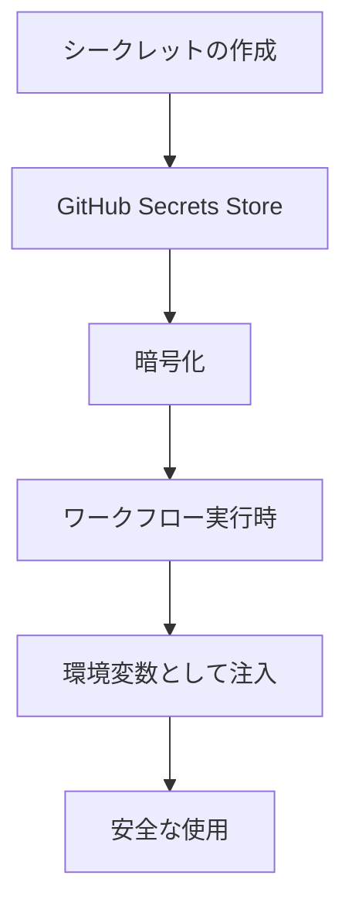
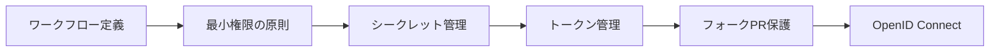

# GitHub Actionsのセキュリティ強化

GitHub Actionsのセキュリティは、CI/CDパイプラインの信頼性と安全性を確保する上で最も重要な要素の一つです。本ガイドでは、GitHub Actionsのセキュリティを強化するための主要な概念と実践的なアプローチについて説明します。

## 主要なセキュリティ概念

GitHub Actionsのセキュリティは、認証、認可、シークレット管理、ワークフロー保護の4つの主要な柱で構成されています。これらの要素を適切に組み合わせることで、安全なCI/CDパイプラインを構築できます。

## 実装例とユースケース

### 1. シークレットの安全な管理

```yaml
name: Secure Secret Usage
on: [push]
jobs:
  secure-job:
    runs-on: ubuntu-latest
    steps:
      - name: Use Secret
        env:
          SECRET_VALUE: ${{ secrets.MY_SECRET }}
        run: echo "Using secret securely"
```

### 2. GITHUB_TOKENの適切な使用

```yaml
name: Secure Token Usage
on: [push]
permissions:
  contents: read
  packages: write
jobs:
  secure-job:
    runs-on: ubuntu-latest
    steps:
      - name: Use Token
        run: echo "Using token with minimal permissions"
```

## セキュリティプロセスの視覚化

### シークレット管理フロー



### セキュリティハードニングプロセス



## 重要なセキュリティ考慮事項

1. **最小権限の原則**
   - ワークフローに必要最小限の権限のみを付与
   - `permissions` キーを使用した明示的な権限設定

2. **シークレット管理**
   - 環境ごとのシークレット分離
   - シークレットの定期的なローテーション
   - 暗号化されたシークレットの使用

3. **フォークPR攻撃対策**
   - `pull_request_target` の慎重な使用
   - 信頼できるワークフローのみを実行
   - 環境変数とシークレットの適切な分離

4. **OpenID Connectの活用**
   - クラウドプロバイダーとの安全な認証
   - 一時的な認証情報の使用
   - 最小権限の原則に基づくアクセス制御

## 参考資料

- [GitHub Actions セキュリティガイド](https://docs.github.com/en/actions/security-guides/security-hardening-for-github-actions)
- [暗号化されたシークレット](https://docs.github.com/en/actions/security-guides/encrypted-secrets)
- [自動トークン認証](https://docs.github.com/en/actions/security-guides/automatic-token-authentication)
- [フォークPR攻撃対策](https://securitylab.github.com/research/github-actions-preventing-pwn-requests/)
- [OpenID Connectによるセキュリティ強化](https://docs.github.com/en/actions/deployment/security-hardening-your-deployments/about-security-hardening-with-openid-connect)
