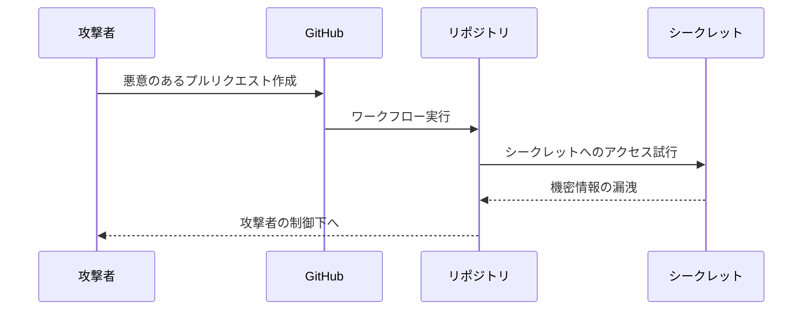

# スクリプトインジェクション攻撃

スクリプトインジェクション攻撃は、GitHub Actionsのワークフローにおいて、悪意のあるコードが実行される可能性のある重要なセキュリティリスクです。

## 概要と重要性

スクリプトインジェクション攻撃は、攻撃者がワークフローファイルに悪意のあるコードを注入し、リポジトリの機密情報へのアクセスや不正な操作を試みる攻撃手法です。GitHub Actionsの自動化機能を悪用されることで、組織のセキュリティに重大な影響を与える可能性があります。

## 主要概念

スクリプトインジェクション攻撃は主に以下の2つの方法で発生します：
1. ワークフローファイルへの直接的なコード注入
2. 外部からの入力値（例：プルリクエストのタイトルやコメント）を介した間接的なコード注入

## 実装例

### 危険な実装例
```yaml
name: 危険なワークフロー
on: [pull_request]
jobs:
  build:
    runs-on: ubuntu-latest
    steps:
      - name: 危険なステップ
        run: ${{ github.event.pull_request.title }}
```

この実装例では、プルリクエストのタイトルをそのまま実行しようとしています。攻撃者がタイトルに悪意のあるコマンドを含めると、それがそのまま実行されてしまう危険があります。

## セキュリティ対策

1. 入力値の検証と制限
   - 外部からの入力値は必ず検証する
   - 許可された値のみを受け入れる
   - 入力値の型や形式を厳密にチェックする

2. コンテキストの制限
   - 必要最小限の権限のみを付与
   - 機密情報へのアクセスを制限
   - ワークフローの実行環境を分離

3. コードレビューと監査
   - ワークフローファイルの定期的なレビュー
   - セキュリティチェックの自動化
   - 依存関係の定期的な更新

4. ベストプラクティス
   - 環境変数の適切な使用
   - シークレットの安全な管理
   - ワークフローの最小権限原則の適用

## 攻撃の流れ



## 参考資料

- [GitHub Actions のセキュリティ強化](https://docs.github.com/ja/actions/security-guides/security-hardening-for-github-actions)
- [GitHub Actions のワークフロー構文](https://docs.github.com/ja/actions/using-workflows/workflow-syntax-for-github-actions)
