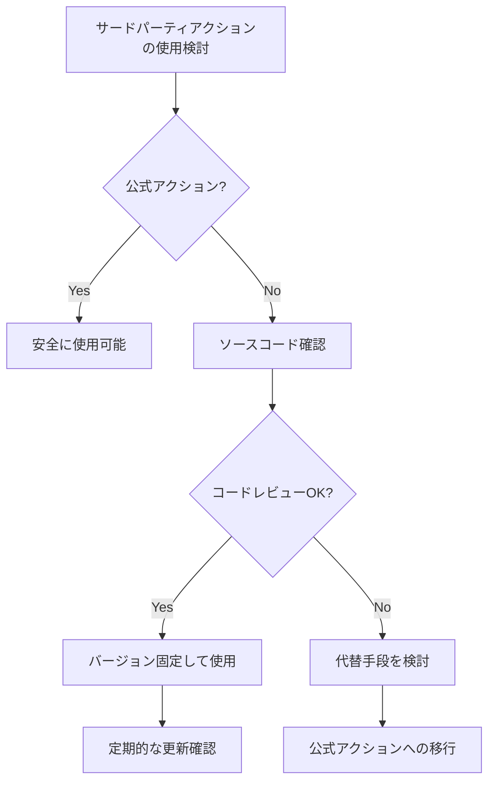

# 悪意のあるサードパーティアクションの脅威と対策

GitHub Actionsのサードパーティアクションは便利ですが、悪意のあるコードが含まれるリスクがあり、セキュリティ上の重大な脅威となる可能性があります。

## 主要概念

サードパーティアクションは、GitHub Marketplaceで公開されている再利用可能なワークフローコンポーネントですが、これらを信頼する前に適切なセキュリティ評価が必要です。

## 実装例とユースケース

### 安全なアクションの使用例
```yaml
# 安全な実装例
- uses: actions/checkout@v4  # 公式アクション
- uses: actions/setup-node@v4  # 公式アクション
```

### 危険な実装例
```yaml
# 危険な実装例
- uses: unknown-user/unknown-action@main  # 信頼性の低いアクション
- uses: some-action@latest  # バージョン指定なし
```

## セキュリティ対策

1. 公式アクションの優先使用
2. アクションのバージョン固定（@v1.0.0 のように）
3. アクションのソースコード確認
4. 最小権限の原則に基づく権限設定

## セキュリティ評価フロー



## ベストプラクティス

1. アクションの使用前に必ずソースコードを確認
2. 特定のバージョンを指定して使用
3. 定期的なセキュリティアップデートの確認
4. 必要最小限の権限設定
5. セキュリティスキャンツールの活用

## 参考資料

- [GitHub Actions のセキュリティ強化](https://docs.github.com/ja/actions/security-guides/security-hardening-for-github-actions)
- [GitHub Marketplace のセキュリティガイドライン](https://docs.github.com/ja/actions/creating-actions/publishing-actions-in-github-marketplace)
