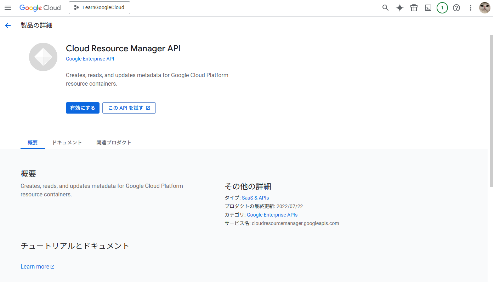

# GCP API有効化について

## ⚠️ 重要な注意事項

**TerraformでGCPにリソースをデプロイする際は、先に必要なAPIを有効化しておかないと `terraform apply` が失敗します。**

初めて使用するAPIや、プロジェクトで有効化されていないAPIを使用しようとすると、以下のようなエラーが発生します：

```
Error: googleapi: Error 403: Compute Engine API has not been used in project <project_id> before or it is disabled. Enable it by visiting https://console.developers.google.com/apis/api/compute.googleapis.com/overview?project=<project_id> then retry. If you enabled this API recently, wait a few minutes for the action to propagate to our systems and retry.
```

使用するGCPリソースによって必要なAPIが異なります。よく使用されるAPIの例：

- **Cloud Resource Manager API** (`cloudresourcemanager.googleapis.com`): プロジェクトやリソースの管理に必要
- **Compute Engine API** (`compute.googleapis.com`): Compute Engineリソース（VM、ディスクなど）に必要
- **Cloud Storage API** (`storage-component.googleapis.com`): Cloud Storageのバケットに必要
- **IAM API** (`iam.googleapis.com`): サービスアカウントや権限管理に必要

## APIの有効化方法

### 方法1: Terraformで有効化する（推奨）

TerraformでAPIを有効化することで、コードとして管理でき、再現性が高くなります。

```hcl
resource "google_project_service" "compute" {
  project = var.project_id
  service = "compute.googleapis.com"
  
  # API有効化の無効化を防止（デフォルトでは削除時に無効化される）
  disable_on_destroy = false
}
```

複数のAPIを有効化する場合：

```hcl
resource "google_project_service" "required_apis" {
  for_each = toset([
    "compute.googleapis.com",
    "cloudresourcemanager.googleapis.com",
    "iam.googleapis.com",
    "storage-component.googleapis.com",
  ])

  project = var.project_id
  service = each.value
  disable_on_destroy = false
}
```

**重要**: APIを有効化してからでないと作成できないリソースは、`depends_on` で依存関係を明示してください。

```hcl
resource "google_project_service" "compute" {
  project = var.project_id
  service = "compute.googleapis.com"
}

resource "google_compute_instance" "example" {
  # ... 設定 ...
  
  depends_on = [google_project_service.compute]
}
```

参考: [TerraformでGCPのAPIを有効化する - Zenn](https://zenn.dev/ring_belle/articles/gcp-terraform-api-activate)

### 方法2: Google Cloud Console から有効化

1. [Google Cloud Console](https://console.cloud.google.com/) にアクセス
2. 該当するプロジェクトを選択
3. 「APIとサービス」→「ライブラリ」を開く
4. 必要なAPIを検索（例: 「Compute Engine API」）
5. 「有効にする」をクリック



参考: https://dev.classmethod.jp/articles/google-cloud-platform-terraform-project_services/

### 方法3: gcloud CLI から有効化

```bash
gcloud services enable compute.googleapis.com --project=YOUR_PROJECT_ID
gcloud services enable cloudresourcemanager.googleapis.com --project=YOUR_PROJECT_ID
```

## エラーの具体例

### Cloud Resource Manager API が有効化されていない場合

HCP Terraform ↔ Google Cloud を連携後、初めてお試しプロジェクトを Apply してみたところ以下エラーが出ました。

```
googleapi: Error 403: Cloud Resource Manager API has not been used in project XXXXXXXXX before or it is disabled
```

このエラーは **「Cloud Resource Manager API がプロジェクトで有効化されていない」** という意味です。

## ベストプラクティス

1. **事前にAPI有効化**: プロジェクト作成時やデプロイ前に、必要なAPIを事前に有効化しておく
2. **Terraformコード化**: API有効化もTerraformコードで管理し、バージョン管理する
3. **依存関係の明示**: `depends_on` を使用して、API有効化とリソース作成の依存関係を明確にする
4. **エラーメッセージの確認**: エラーメッセージに記載されているURLから、必要なAPIを特定できる

## その他

プロジェクト単位でなく、アカウント単位で有効化する必要があれば使いたいところ（プロジェクト作るたびに有効化は面倒）