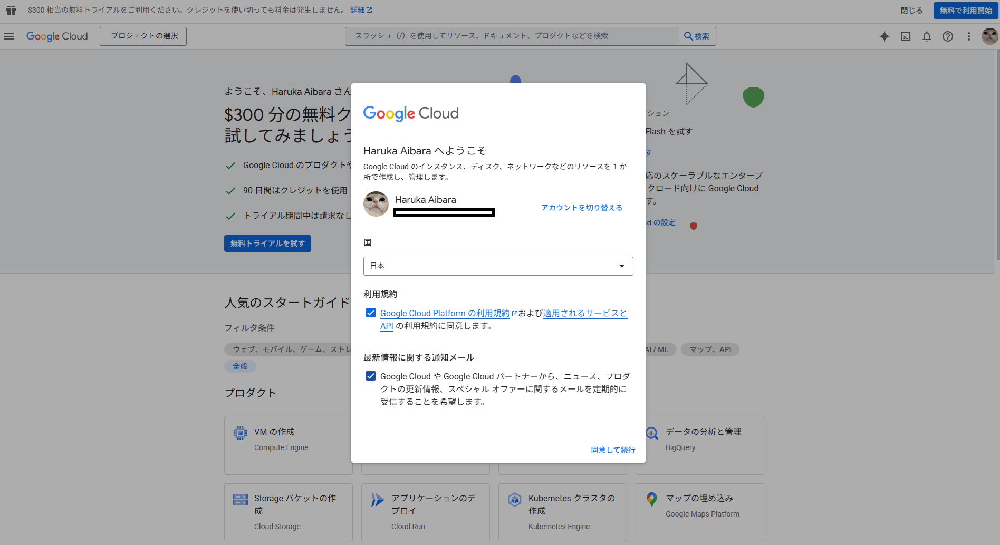
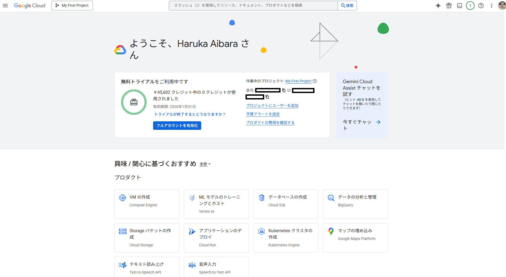

# Google Cloud 利用開始ガイド

## とりあえずアカウント作って始める

### 1. アカウント作成と無料トライアルの開始

1. [Google Cloud Console](https://console.cloud.google.com/) にアクセス
2. Googleアカウントでサインイン

1. 利用規約に同意
2. **無料トライアルを試す**を開始（90日間、**$300相当のクレジット**付き）
3. 支払い情報を登録（クレジットカードまたはデビットカード）
4. 完了

表示される内容に従い進めていくと、コンソールのトップ画面に遷移します。

**注意**: 
- 支払い情報の登録が必要ですが、$300のクレジットを使い切るまでは課金されません
- 90日後、または$300を使い切った時点で無料トライアルは終了します
- 無料トライアル終了後も、Google Cloudの無料枠（Always Free）は継続して利用可能です

### 2. プロジェクトの作成

1. [Google Cloud Console](https://console.cloud.google.com/) にアクセス
2. 画面上部のプロジェクト選択ドロップダウンから「**新しいプロジェクト**」を選択
3. プロジェクト名を入力（例: `my-first-project`）
4. プロジェクトIDは自動生成されます（変更可能）
5. 「**作成**」をクリック

これで準備完了！$300のクレジットを使って90日間試せます。

## 参考

- [Google Cloud Console](https://console.cloud.google.com/)
- [Google Cloud 無料トライアル詳細](https://cloud.google.com/free)
- [Google Cloud のプロジェクトについて](./Google%20Cloud%20のプロジェクトについて.md)
