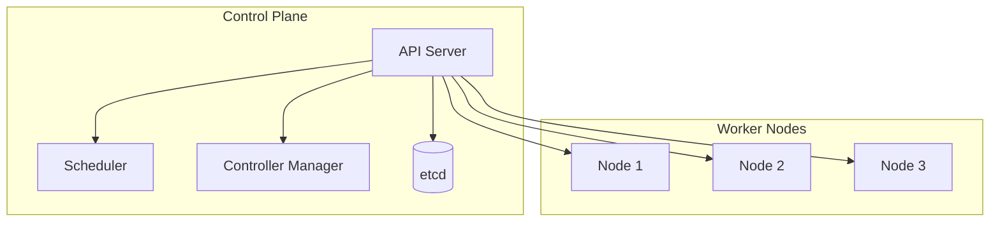
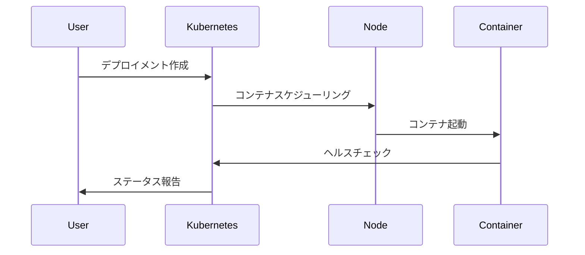

# Kubernetes概要

## これって何？
Kubernetes（K8s）は、コンテナ化されたアプリケーションの管理を自動化するためのオープンソースプラットフォームです。コンテナのデプロイ、スケーリング、運用を効率的に行うための「コンテナオーケストレーション」ツールとして、現代のクラウドネイティブアプリケーション開発に不可欠な存在となっています。

## なぜ必要なのか

### Kubernetesがない場合の問題点
- コンテナの手動管理が必要になり、運用負荷が増大
- スケーリングや障害復旧を手動で行う必要がある
- 環境間の一貫性を保つのが困難
- リソースの効率的な利用が難しい

### Kubernetesを導入することで得られるメリット
- コンテナの自動デプロイと管理が可能
- スケーリングや障害復旧の自動化
- 環境間の一貫性の確保
- リソースの効率的な利用
- 宣言的な構成管理による運用の簡素化

## 重要なポイント

### 1. 宣言的な構成管理
Kubernetesは「望ましい状態」を宣言するだけで、その状態を自動的に維持します。これにより、複雑な運用タスクを自動化し、ヒューマンエラーを削減できます。

### 2. 自動化と自己修復
コンテナの障害検知、自動再起動、負荷に応じたスケーリングなど、多くの運用タスクを自動化します。

### 3. ポータビリティ
クラウド、オンプレミス、ハイブリッド環境など、様々な環境で同じように動作します。

## 実際の使い方

### 基本的な構成要素
```yaml
apiVersion: apps/v1
kind: Deployment
metadata:
  name: nginx-deployment
spec:
  replicas: 3
  selector:
    matchLabels:
      app: nginx
  template:
    metadata:
      labels:
        app: nginx
    spec:
      containers:
      - name: nginx
        image: nginx:1.14.2
```

## 図解による説明

### Kubernetesの基本アーキテクチャ


### コンテナのライフサイクル管理


## 参考リンク
- [Kubernetes公式ドキュメント](https://kubernetes.io/docs/concepts/overview/)
- [Red Hat: What is Kubernetes?](https://www.redhat.com/en/topics/containers/what-is-kubernetes)
- [The New Stack: Kubernetes Overview](https://thenewstack.io/kubernetes/)
