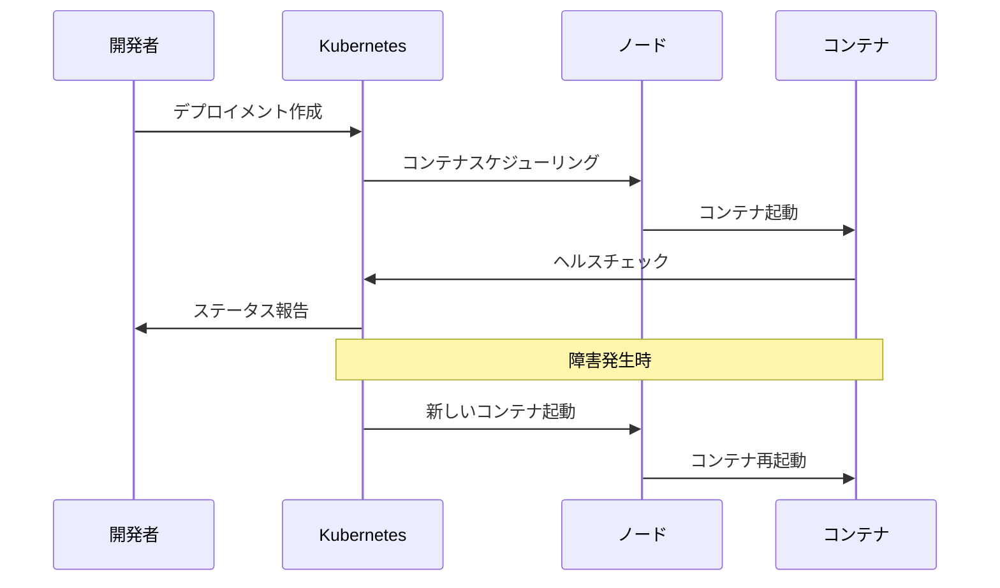

# なぜKubernetesか

## これって何？
Kubernetes（k8s）は、コンテナ化されたアプリケーションを大規模にデプロイおよび管理するための強力で柔軟性の高いプラットフォームです。コンテナの自動化、スケーリング、運用管理を効率的に行うための「コンテナオーケストレーション」ツールとして、現代のクラウドネイティブアプリケーション開発に不可欠な存在となっています。

## なぜ必要なのか

### Kubernetesがない場合の問題点
- コンテナの手動管理が必要になり、運用負荷が増大
- スケーリングや障害復旧を手動で行う必要がある
- 環境間の一貫性を保つのが困難
- リソースの効率的な利用が難しい
- 運用チームが戦略的な業務に集中できない

### Kubernetesを導入することで得られるメリット
- アプリケーションの需要に応じた自動スケーリング
- 高い回復力と自己修復機能
- 様々な環境での一貫した動作
- 運用タスクの自動化
- コンテナプラットフォームの標準化
- 運用チームの効率化

## 重要なポイント

### 1. スケーラビリティ
Kubernetesは、アプリケーションの需要に応じて自動的にスケールアップまたはスケールダウンを行います。これにより、リソースの効率的な利用とコスト最適化が実現できます。

### 2. 回復力と自己修復
コンテナの障害を自動的に検出し、新しいコンテナを起動することで、アプリケーションの可用性を維持します。

### 3. 環境の移植性
オンプレミス、クラウド、ハイブリッド環境など、様々な環境で一貫した動作を保証します。

## 実際の使い方

### スケーリングの例
```yaml
apiVersion: apps/v1
kind: Deployment
metadata:
  name: nginx-deployment
spec:
  replicas: 3
  selector:
    matchLabels:
      app: nginx
  template:
    metadata:
      labels:
        app: nginx
    spec:
      containers:
      - name: nginx
        image: nginx:1.14.2
        resources:
          requests:
            memory: "64Mi"
            cpu: "250m"
          limits:
            memory: "128Mi"
            cpu: "500m"
```

## 図解による説明

### 従来の運用とKubernetesの比較


### コンテナのライフサイクル管理


## 参考リンク
- [Kubernetes公式ドキュメント: Why you need Kubernetes](https://kubernetes.io/docs/concepts/overview/#why-you-need-kubernetes-and-what-can-it-do)
- [Predica Group: Why should you use Kubernetes?](https://www.predicagroup.com/blog/why-kubernetes-2022/)
- [The New Stack: Primer: How Kubernetes Came to Be](https://thenewstack.io/primer-how-kubernetes-came-to-be-what-it-is-and-why-you-should-care/)
