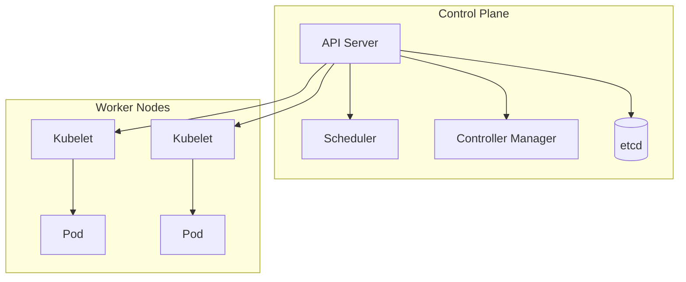
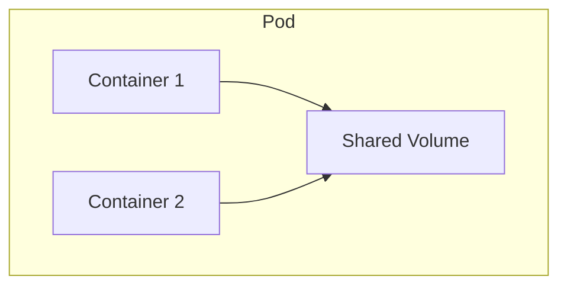
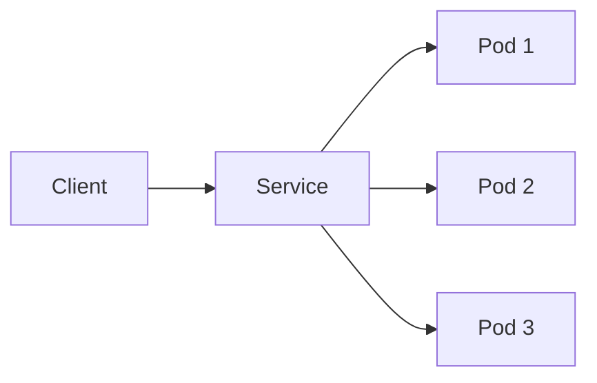

# Kubernetes: 重要な概念と用語

## 1. トピックの説明
Kubernetesは、コンテナ化されたアプリケーションのデプロイ、スケーリング、管理を自動化するためのオープンソースのコンテナオーケストレーションプラットフォームです。

## 2. なぜ必要なのか
### この機能がないとどうなるのか
- コンテナの手動管理が必要になり、人的ミスが発生しやすくなる
- スケーリングや障害復旧に時間がかかる
- アプリケーションの一貫性を保つのが難しい

### どのような問題が発生するのか
- コンテナの死活監視が困難
- 負荷に応じた自動スケーリングができない
- 複数環境での一貫したデプロイが難しい
- リソースの効率的な利用が困難

### どのようなメリットがあるのか
- コンテナの自動デプロイと管理
- 高可用性とスケーラビリティの実現
- 宣言的な設定による一貫性の確保
- リソースの効率的な利用

## 3. 重要なポイントの解説
Kubernetesの主要な概念を理解することで、コンテナ化されたアプリケーションを効率的に管理し、スケーラブルなシステムを構築できます。特に、Pod、Service、Deploymentなどの基本概念の理解が重要です。

## 4. 実際の使い方や具体例
### 基本的なデプロイメントの例
```yaml
apiVersion: apps/v1
kind: Deployment
metadata:
  name: nginx-deployment
spec:
  replicas: 3
  selector:
    matchLabels:
      app: nginx
  template:
    metadata:
      labels:
        app: nginx
    spec:
      containers:
      - name: nginx
        image: nginx:1.14.2
        ports:
        - containerPort: 80
```

## 5. 図解による説明

### クラスターアーキテクチャ


### Podとコンテナの関係


### サービスとPodの関係


## クラスターアーキテクチャ
Kubernetesのクラスターアーキテクチャはコンテナ化されたアプリケーションを管理するための基盤構造です。
クラスターは、マスターコンポーネント（コントロールプレーン）とノードから構成されています。

### コントロールプレーンの主要コンポーネント
- API Server: クラスターの管理インターフェース
- Scheduler: Podの配置を決定
- Controller Manager: 各種コントローラーを実行
- etcd: クラスターの状態を保存

### ノードの主要コンポーネント
- Kubelet: ノード上でコンテナを実行
- Container Runtime: コンテナの実行環境
- Kube-proxy: ネットワークプロキシ

## コンテナ
コンテナはアプリケーションとその実行環境をパッケージ化する軽量な技術です。
Kubernetesでは主にDockerコンテナを使用しますが、他のコンテナランタイムもサポートしています。

### コンテナの特徴
- 軽量性: 仮想マシンと比較して軽量
- 移植性: 環境に依存しない実行が可能
- 分離性: アプリケーション間の独立性を確保

## ワークロード
### Pod
Podはクラスター内で作成・管理できる最小のデプロイ単位です。
一つまたは複数のコンテナとストレージリソースを共有するグループです。

### Deployment
Deploymentは、Podとそのレプリカを宣言的に管理するためのリソースです。
アプリケーションの状態を定義し、アップデートやロールバックなどを制御します。

### StatefulSet
StatefulSetは、ステートフルなアプリケーションを管理するためのワークロードAPIオブジェクトです。
永続データを持つアプリケーションのデプロイと管理に使用されます。

### DaemonSet
DaemonSetはすべてのノード（または特定のノード）上でPodのコピーを実行することを保証するリソースです。
ログ収集やノードモニタリングなどのクラスター全体のサービスに使用されます。

### Job
Jobは、指定されたタスクを完了するまで実行するPodを作成します。
バッチ処理などの一度限りのタスクに適しています。

### CronJob
CronJobは、時間ベースのスケジュールに従って定期的にJobを作成します。
バックアップや定期レポート生成などの反復タスクに使用されます。

## サービス、ロードバランシング、ネットワーキング
### Service
Serviceは、一連のPodと、それらにアクセスするためのポリシーを定義する抽象化です。
Podの動的な性質にかかわらず、安定したネットワークアクセスを提供します。

### Ingress
Ingressはクラスター外部からクラスター内のサービスへのHTTP/HTTPSルートを管理するAPIリソースです。
外部アクセスのルールやTLS設定を提供します。

### NetworkPolicy
NetworkPolicyは、Podがどのようにネットワーク通信を行うかを指定するリソースです。
Pod間のネットワークトラフィックを制御するファイアウォールのように機能します。

## ストレージ
### PersistentVolume (PV)
PersistentVolumeはクラスター内の永続ストレージのプロビジョニングを抽象化したリソースです。
クラウドプロバイダーやオンプレミスのストレージを統一的に管理します。

### PersistentVolumeClaim (PVC)
PersistentVolumeClaimはユーザーによるストレージの要求を表すリソースです。
Podがストレージリソースを要求するために使用されます。

### StorageClass
StorageClassは管理者が提供するストレージの「クラス」を定義します。
動的なボリュームプロビジョニングや異なる品質のサービスを可能にします。

## 構成
### ConfigMap
ConfigMapはキーと値のペアの形で構成データを保存するリソースです。
環境変数、コマンドライン引数、設定ファイルなどの形式でPodにマウントできます。

### Secret
Secretはパスワード、OAuth トークン、SSH キーなどの機密情報を保存するリソースです。
ConfigMapと似ていますが、機密データ向けに設計されています。

## クラスター管理
### Namespace
Namespaceはクラスター内のリソースを論理的に分離するリソースです。
マルチテナント環境でリソースを整理したり、アクセス制御したりするために使用されます。

### RBAC
Role-Based Access Control (RBAC)は、ユーザーやグループに特定の権限を付与する仕組みです。
RoleとClusterRole、RoleBindingとClusterRoleBindingで構成されます。

### ResourceQuota
ResourceQuotaはNamespace内でのリソース使用量を制限するリソースです。
CPUやメモリなどのリソース消費量を制御します。

### HorizontalPodAutoscaler
HorizontalPodAutoscalerはワークロードのスケールを自動的に調整するリソースです。
CPU使用率などのメトリクスに基づいてPodの数を増減します。

## 参考リンク
- [Kubernetes公式ドキュメント - コンセプト](https://kubernetes.io/docs/concepts/)
- [GitLab - Kubernetes用語解説](https://about.gitlab.com/blog/2020/07/30/kubernetes-terminology/)
- [Kubernetes入門動画](https://www.youtube.com/watch?v=QJ4fODH6DXI)
- [Kubernetes 2分間解説](https://youtu.be/XfBrtNZ2OCw)
