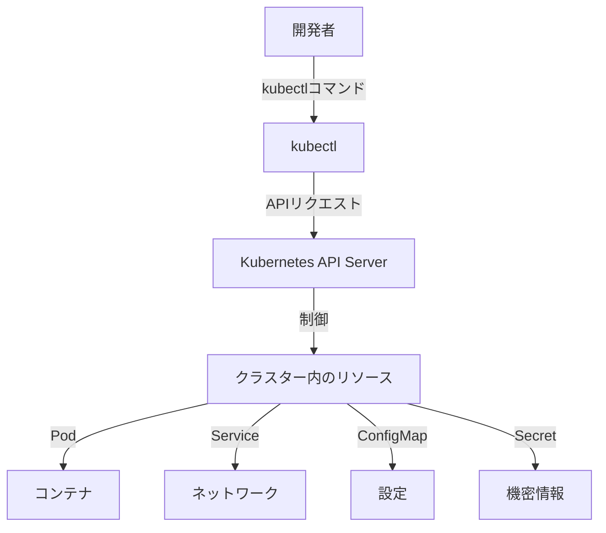

# kubectl コマンド入門

## 1. トピックの簡単な説明
kubectlはKubernetesクラスターを操作するための主要なコマンドラインツールで、コンテナの実行環境を制御するための「リモコン」のような存在です。

## 2. なぜ必要なのか
### この機能がないとどうなるのか
- クラスターの状態確認や操作が手動で行う必要があり、非効率
- コンテナの起動・停止などの基本的な操作も自動化できない
- トラブルシューティングが困難になる

### どのような問題が発生するのか
- コンテナの状態確認に時間がかかる
- 操作ミスが発生しやすい
- 複数のコンテナを効率的に管理できない
- トラブル時の原因特定が困難

### どのようなメリットがあるのか
- クラスターの状態を簡単に確認できる
- コンテナの操作を効率的に行える
- トラブルシューティングが容易になる
- 自動化やスクリプト化が可能

## 3. 重要なポイントの解説
kubectlは、Kubernetes APIサーバーと通信して、JSONやYAMLで定義されたオブジェクトを操作します。これにより、複雑なコンテナ環境を簡単に制御できるようになります。

## 4. 実際の使い方や具体例

### 基本的なコマンド
```bash
# Podの作成と実行
kubectl run nginx --image=nginx

# Podの一覧表示
kubectl get pods

# Podの詳細情報表示
kubectl describe pod my-pod

# ログの確認
kubectl logs my-pod

# コンテナ内でコマンド実行
kubectl exec -it my-pod -- /bin/bash
```

### 環境変数の設定
```bash
# 環境変数を指定してPodを実行
kubectl run nginx --image=nginx --env="DB_HOST=mysql" --env="DB_PORT=3306"
```

### トラブルシューティング
```bash
# Podの状態確認
kubectl get pod my-pod

# 詳細な問題分析
kubectl describe pod my-pod

# ログの確認
kubectl logs my-pod
```

## 5. 図解による説明



この図は、kubectlが開発者とKubernetesクラスターの間の橋渡し役として機能する様子を示しています。開発者がkubectlコマンドを実行すると、それがAPIサーバーを通じてクラスター内の様々なリソースを制御します。

## セキュリティ面での注意点
- 適切なRBACポリシーを設定して、必要最小限の権限のみを付与する
- 機密情報を含むコマンドの実行履歴を適切に管理する
- 本番環境での操作は慎重に行い、変更前に影響範囲を確認する

## 参考情報
- [Kubernetes公式ドキュメント - kubectl](https://kubernetes.io/docs/reference/kubectl/)
- [kubectl Cheat Sheet](https://kubernetes.io/docs/reference/kubectl/cheatsheet/)
