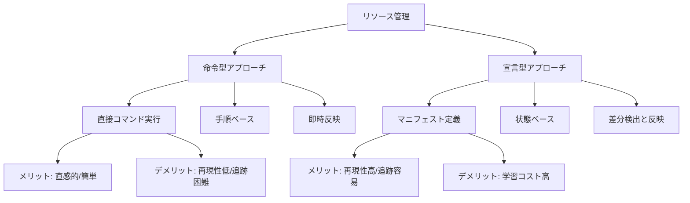

# Kubernetesにおける命令型(Imperative)と宣言型(Declarative)アプローチ

## 1. トピックの簡単な説明
Kubernetesでは、リソースを管理する2つの異なるアプローチがあります。命令型は「どのように行うか」を指示し、宣言型は「どのような状態であるべきか」を定義します。

## 2. なぜ必要なのか

### この機能がないとどうなるのか
- リソースの管理が手動になり、ヒューマンエラーが発生しやすくなる
- 環境の再現性が低くなり、本番環境と開発環境の差異が生まれやすい
- 変更履歴の追跡が困難になり、問題発生時の原因特定が難しくなる

### どのような問題が発生するのか
- 手動操作による設定の不一致
- 環境ごとの設定の違いによる予期せぬ動作
- 変更の追跡が困難で、誰がいつ何を変更したかが不明確

### どのようなメリットがあるのか
- 環境の一貫性を保証できる
- 変更履歴を追跡しやすくなる
- 自動化やCI/CDとの親和性が高まる
- チーム開発での協業がスムーズになる

## 3. 重要なポイントの解説
命令型と宣言型の使い分けは、Kubernetesの運用効率と安全性を大きく左右します。特に本番環境では、宣言型アプローチによる管理が推奨されます。

## 4. 実際の使い方や具体例

### 命令型アプローチ
```bash
# Podの作成
kubectl run nginx --image=nginx

# Serviceの作成
kubectl create service clusterip my-service --tcp=80:80

# Deploymentのスケール
kubectl scale deployment nginx-deployment --replicas=5
```

### 宣言型アプローチ
```yaml
# deployment.yaml
apiVersion: apps/v1
kind: Deployment
metadata:
  name: nginx-deployment
spec:
  replicas: 3
  selector:
    matchLabels:
      app: nginx
  template:
    metadata:
      labels:
        app: nginx
    spec:
      containers:
      - name: nginx
        image: nginx:latest
```

```bash
# マニフェストの適用
kubectl apply -f deployment.yaml
```

## 5. 図解による説明



この図は、命令型と宣言型アプローチの違いを視覚的に表現しています。命令型は直接的な操作を、宣言型は状態の定義を重視することを示しています。

## ベストプラクティス

1. **開発/学習時**: 命令型アプローチを使用
   - クイックなテストや学習に適している
   - 直感的な操作が可能

2. **本番環境**: 宣言型アプローチを使用
   - マニフェストファイルによる管理
   - GitOpsとの連携
   - 変更履歴の追跡

3. **移行戦略**:
   - 命令型コマンドで学習
   - マニフェストの理解
   - 宣言型への段階的な移行
