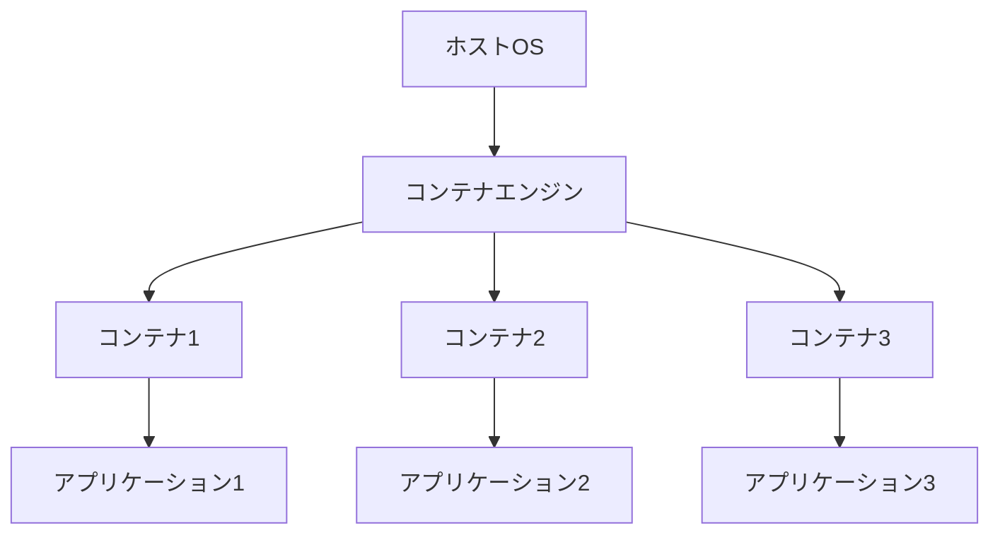

# コンテナの概要

コンテナは、アプリケーションとその依存関係をパッケージ化し、どの環境でも一貫して動作させるための技術です。Kubernetesを学ぶ前に、コンテナの基本概念を理解することは非常に重要です。

## 主要概念

コンテナは、OSレベルの仮想化技術を使用して、アプリケーションを独立した環境で実行する仕組みです。ホストOSのカーネルを共有しながら、アプリケーションごとに分離された実行環境を提供します。

## 実装例とユースケース

基本的なDockerfileの例：

```dockerfile
FROM node:18-alpine
WORKDIR /app
COPY package*.json ./
RUN npm install
COPY . .
EXPOSE 3000
CMD ["npm", "start"]
```

このDockerfileは、Node.jsアプリケーションをコンテナ化する基本的な例です。軽量なAlpine Linuxベースイメージを使用し、アプリケーションの依存関係をインストールして実行します。

## コンテナの仕組み



## セキュリティ考慮事項

- コンテナは分離されていますが、完全なセキュリティを保証するものではありません
- 最小権限の原則に従い、必要最小限の権限でコンテナを実行する
- 公式イメージを使用し、定期的にセキュリティアップデートを適用する

## 参考資料

- [公式Dockerチュートリアル](https://docs.docker.com/get-started/)
- [Dockerカリキュラム](https://docker-curriculum.com/)
- [Docker in 100 Seconds](https://www.youtube.com/watch?v=Gjnup-PuquQ)
- [Docker for Beginners - 3時間無料コース](https://www.youtube.com/watch?v=fqMOX6JJhGo)
