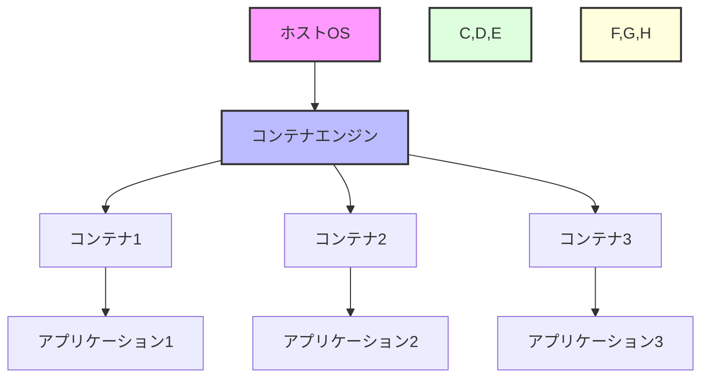

# コンテナの概要

コンテナは、アプリケーションとその依存関係をパッケージ化し、どの環境でも一貫して動作させるための技術です。OSレベルの仮想化を利用して、アプリケーションを独立した環境で実行する仕組みを提供します。

## なぜコンテナが必要なのか

### コンテナがない場合の問題点
- 開発環境と本番環境の違いによる「動くはずなのに動かない」問題が発生
- 依存関係の競合やバージョンの不一致が起きやすい
- 環境構築に時間がかかり、開発効率が低下
- アプリケーションの移行やスケーリングが困難

### コンテナを導入することで得られるメリット
- 環境の一貫性が保証され、「動くはずなのに動かない」問題を解消
- 依存関係の競合を防ぎ、アプリケーションの独立性を確保
- 環境構築の自動化により、開発効率が向上
- アプリケーションの移行やスケーリングが容易に

## 重要なポイント

コンテナの最大の特徴は、アプリケーションとその依存関係を「箱」に詰めることで、環境に依存せずに実行できる点です。これにより、開発から本番まで一貫した環境を維持でき、DevOpsの実践が容易になります。

## コンテナの仕組み



この図は、コンテナの基本的な構造を示しています：
- ホストOS上でコンテナエンジンが動作
- コンテナエンジンが複数のコンテナを管理
- 各コンテナは独立した環境でアプリケーションを実行

## 実践的な例

### 基本的なDockerfileの例
```dockerfile
FROM node:18-alpine
WORKDIR /app
COPY package*.json ./
RUN npm install
COPY . .
EXPOSE 3000
CMD ["npm", "start"]
```

このDockerfileは以下の特徴を持ちます：
- 軽量なAlpine Linuxベースイメージを使用
- 依存関係を効率的にインストール
- アプリケーションのコードを適切に配置
- 必要なポートを公開

## セキュリティ上の注意点

1. 最小権限の原則
   - 必要最小限の権限でコンテナを実行
   - rootユーザーでの実行を避ける

2. イメージの安全性
   - 公式イメージを優先的に使用
   - 定期的なセキュリティアップデートの適用
   - 不要なパッケージの削除

3. ネットワークセキュリティ
   - 必要なポートのみを公開
   - コンテナ間の通信を適切に制限

## 参考資料

- [公式Dockerチュートリアル](https://docs.docker.com/get-started/)
- [Dockerカリキュラム](https://docker-curriculum.com/)
- [Docker in 100 Seconds](https://www.youtube.com/watch?v=Gjnup-PuquQ)
- [Docker for Beginners - 3時間無料コース](https://www.youtube.com/watch?v=fqMOX6JJhGo)
