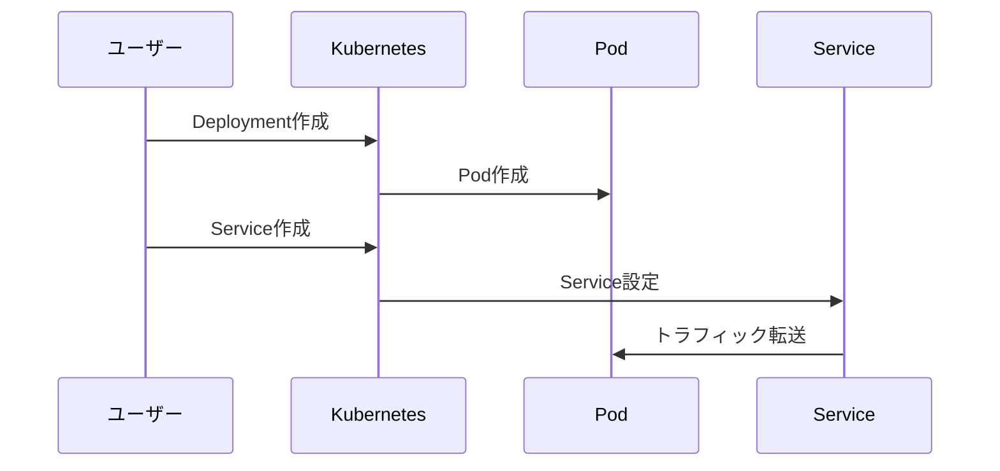

# 初めてのアプリケーションのデプロイ

## はじめに

「アプリケーションのデプロイに時間がかかりすぎる...」「環境の違いで思ったように動かない...」そんな悩みはありませんか？Kubernetesを使えば、これらの問題を簡単に解決できます。この記事では、Kubernetesでの最初のアプリケーションデプロイについて、実践的な手順を解説します。

## ざっくり理解しよう

Kubernetesでのデプロイの全体像を3つのポイントで押さえましょう：

1. **Deploymentリソース**: アプリケーションのPodを管理し、スケーリングや更新を自動化します。これにより、アプリケーションの可用性を確保できます。

2. **Serviceリソース**: アプリケーションへのアクセスを提供し、ロードバランシングを行います。内部・外部からのアクセスを適切に制御できます。

3. **宣言的な設定**: YAMLファイルで設定を記述することで、環境の再現性を確保し、デプロイの一貫性を保ちます。

## 実際の使い方

### よくある使用シーン
- マイクロサービスアーキテクチャのデプロイ
- ステートレスアプリケーションの運用
- 開発・テスト環境の構築

### メリットと注意点
- **メリット**:
  - 自動的なスケーリング
  - ロールバックが容易
  - 環境の再現性が高い
- **注意点**:
  - 適切なリソース制限の設定
  - セキュリティ設定の確認
  - ネットワークポリシーの考慮

## 手を動かしてみよう

### 1. Deploymentの作成
```yaml
apiVersion: apps/v1
kind: Deployment
metadata:
  name: nginx-deployment
spec:
  replicas: 3
  selector:
    matchLabels:
      app: nginx
  template:
    metadata:
      labels:
        app: nginx
    spec:
      containers:
      - name: nginx
        image: nginx:1.21
        ports:
        - containerPort: 80
```

### 2. Serviceの作成
```yaml
apiVersion: v1
kind: Service
metadata:
  name: nginx-service
spec:
  selector:
    app: nginx
  ports:
    - protocol: TCP
      port: 80
      targetPort: 80
  type: ClusterIP
```

### デプロイの流れ


## 実践的なサンプル

### 基本的な設定パターン
1. **単一コンテナのデプロイ**
   - 基本的なDeploymentとService
   - リソース制限の設定
   - ヘルスチェックの設定

2. **マルチコンテナのデプロイ**
   - サイドカーコンテナの追加
   - ボリュームの共有
   - コンテナ間の通信設定

## 困ったときは

### よくあるトラブルと解決方法
1. **Podが起動しない**
   - イメージ名の確認
   - リソース制限の確認
   - コンテナログの確認

2. **Serviceにアクセスできない**
   - セレクターの確認
   - ポート設定の確認
   - ネットワークポリシーの確認

## もっと知りたい人へ

### 次のステップ
- ステートフルアプリケーションのデプロイ
- カスタムリソースの作成
- オートスケーリングの設定

### おすすめの学習リソース
- [Kubernetes公式ドキュメント](https://kubernetes.io/docs/tutorials/kubernetes-basics/deploy-app/deploy-intro/)
- [Kubernetesパターン](https://k8spatterns.io/)
- [Kubernetes Best Practices](https://cloud.google.com/blog/products/containers-kubernetes/kubernetes-best-practices)
