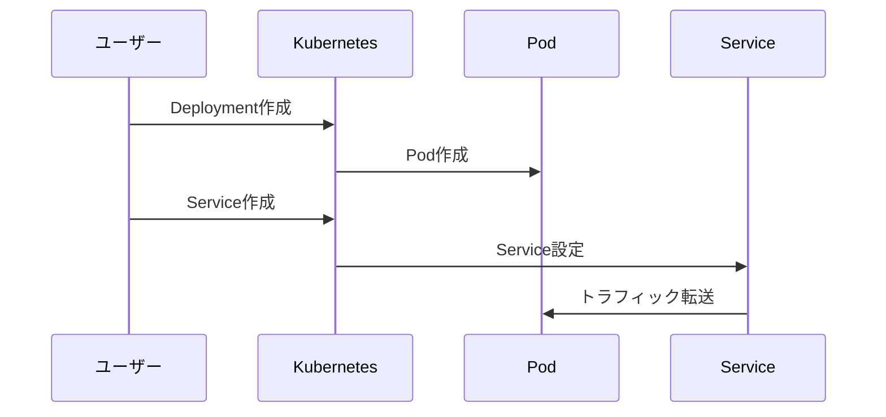

# 初めてのアプリケーションのデプロイ

Kubernetesクラスターへの最初のアプリケーションデプロイは、コンテナ化されたアプリケーションをKubernetes環境で実行するための基本的な手順です。

## なぜ必要なのか

- **この機能がないとどうなるのか**
  - アプリケーションを手動で各サーバーにデプロイする必要がある
  - スケーリングや障害時の復旧を手動で行う必要がある
  - 環境の一貫性を保つのが難しい

- **どのような問題が発生するのか**
  - デプロイ作業の人的ミスが発生しやすい
  - 環境の差異による予期せぬ動作が起きる
  - スケーリングや障害対応に時間がかかる

- **どのようなメリットがあるのか**
  - 宣言的な設定による一貫したデプロイが可能
  - 自動的なスケーリングと障害復旧
  - 環境の再現性が確保される

## 重要なポイント

Kubernetesでのデプロイは、DeploymentとServiceという2つの主要なリソースを使用します。DeploymentはアプリケーションのPodを管理し、Serviceはアプリケーションへのアクセスを提供します。これにより、アプリケーションの可用性とスケーラビリティを確保できます。

## 実際の使い方

### 1. Deploymentの作成

```yaml
apiVersion: apps/v1
kind: Deployment
metadata:
  name: nginx-deployment
spec:
  replicas: 3
  selector:
    matchLabels:
      app: nginx
  template:
    metadata:
      labels:
        app: nginx
    spec:
      containers:
      - name: nginx
        image: nginx:1.21
        ports:
        - containerPort: 80
```

### 2. Serviceの作成

```yaml
apiVersion: v1
kind: Service
metadata:
  name: nginx-service
spec:
  selector:
    app: nginx
  ports:
    - protocol: TCP
      port: 80
      targetPort: 80
  type: ClusterIP
```

## デプロイの流れ



## セキュリティ考慮事項

- コンテナイメージは信頼できるソースから取得する
- 必要最小限の権限でServiceを公開する
- リソース制限を適切に設定する
- ネットワークポリシーでPod間通信を制御する

## 参考資料

- [Kubernetesアプリケーションのデプロイ A to Z](https://kubernetes.io/docs/tutorials/kubernetes-basics/deploy-app/deploy-intro/)
- [kubectlを使用したDeploymentの作成](https://kubernetes.io/docs/tasks/run-application/run-stateless-application-deployment/)
