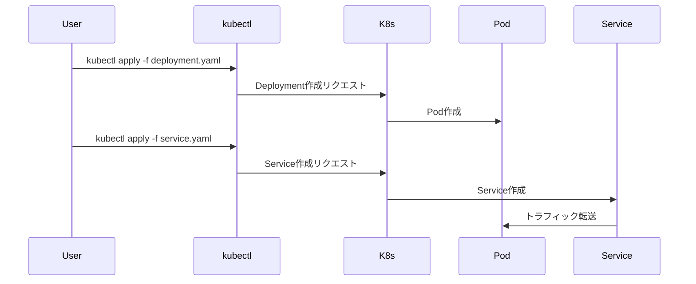

# 初めてのアプリケーションのデプロイ

Kubernetesクラスターへの最初のアプリケーションデプロイは、Kubernetesの基本概念を理解するための重要な第一歩です。このプロセスを通じて、Deployment、Service、Podなどの主要なリソースの役割を学ぶことができます。

## 主要概念

Kubernetesでのアプリケーションデプロイは、主にDeploymentとServiceという2つのリソースを使用します。DeploymentはアプリケーションのPodを管理し、Serviceはアプリケーションへのアクセスを提供します。

## 実装例

### 1. Deploymentの作成

```yaml
apiVersion: apps/v1
kind: Deployment
metadata:
  name: nginx-deployment
spec:
  replicas: 3
  selector:
    matchLabels:
      app: nginx
  template:
    metadata:
      labels:
        app: nginx
    spec:
      containers:
      - name: nginx
        image: nginx:1.21
        ports:
        - containerPort: 80
```

### 2. Serviceの作成

```yaml
apiVersion: v1
kind: Service
metadata:
  name: nginx-service
spec:
  selector:
    app: nginx
  ports:
    - protocol: TCP
      port: 80
      targetPort: 80
  type: ClusterIP
```

## デプロイの流れ



## デプロイの確認手順

1. Deploymentの確認:
```bash
kubectl get deployments
```

2. Podの確認:
```bash
kubectl get pods
```

3. Serviceの確認:
```bash
kubectl get services
```

## セキュリティ考慮事項

- 本番環境では、適切なリソース制限を設定する
- コンテナイメージは信頼できるソースから取得する
- 必要最小限の権限でServiceを公開する
- ネットワークポリシーを適切に設定する

## 参考資料

- [kubectlを使用したDeploymentの作成](https://kubernetes.io/docs/tasks/run-application/run-stateless-application-deployment/)
- [Kubernetesアプリケーションのデプロイ A to Z](https://kubernetes.io/docs/tutorials/kubernetes-basics/deploy-app/deploy-intro/)
- [Kubernetes 101: MicroK8sで最初のアプリケーションをデプロイ](https://microk8s.io/docs/getting-started)
- [Kubernetesチュートリアル | 最初のアプリケーション](https://kubernetes.io/docs/tutorials/kubernetes-basics/deploy-app/deploy-intro/)
- [Kubernetes 101: アプリケーションのデプロイ](https://kubernetes.io/docs/tutorials/kubernetes-basics/deploy-app/deploy-intro/)
