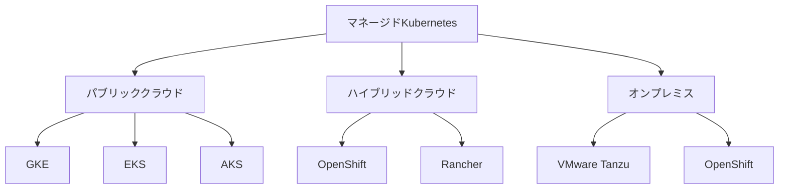

# マネージドプロバイダの選択

## はじめに

「Kubernetesクラスターの運用管理が大変...」「インフラの管理に時間が取られて本業に集中できない...」そんな悩みはありませんか？マネージドKubernetesサービスを使えば、インフラ管理の負担を大幅に軽減できます。この記事では、最適なマネージドプロバイダの選び方について解説します。

## ざっくり理解しよう

マネージドKubernetesの全体像を3つのポイントで押さえましょう：

1. **インフラ管理の自動化**: プロバイダがインフラの構築・運用を担当し、ユーザーはアプリケーション開発に集中できます。

2. **最新機能の即時利用**: プロバイダが最新のKubernetes機能を提供し、常に最新の機能を利用できます。

3. **運用負荷の軽減**: クラスターのアップデート、セキュリティパッチ、バックアップなどの運用タスクを自動化できます。

## 実際の使い方

### よくある使用シーン
- クラウドネイティブアプリケーションの運用
- ハイブリッドクラウド環境の構築
- 開発・テスト環境の迅速な構築

### メリットと注意点
- **メリット**:
  - 運用コストの削減
  - 専門知識の不要
  - スケーラビリティの確保
- **注意点**:
  - ベンダーロックインのリスク
  - コスト管理の重要性
  - セキュリティ設定の確認

## 手を動かしてみよう

### 主要なマネージドプロバイダ

### 選択時のチェックリスト
1. **クラウドプロバイダとの互換性**
   - 既存インフラとの統合
   - マルチクラウド戦略
   - データの所在地

2. **機能と性能**
   - 自動スケーリング
   - 高可用性
   - 監視・ロギング
   - バックアップ

## 実践的なサンプル

### プロバイダ別の特徴
1. **GKE (Google Kubernetes Engine)**
   - 自動アップデート
   - 統合モニタリング
   - セキュリティ機能

2. **EKS (Amazon Elastic Kubernetes Service)**
   - AWSサービスとの統合
   - マネージドノードグループ
   - コントロールプレーンの高可用性

3. **AKS (Azure Kubernetes Service)**
   - Azureサービスとの統合
   - 自動スケーリング
   - マネージドID

## 困ったときは

### よくあるトラブルと解決方法
1. **コストの予測が難しい**
   - リソース使用量の監視
   - 自動スケーリングの設定
   - 予算アラートの設定

2. **パフォーマンスの問題**
   - ノードタイプの最適化
   - リソース制限の設定
   - モニタリングの活用

## もっと知りたい人へ

### 次のステップ
- マルチクラウド戦略の検討
- コスト最適化の実施
- セキュリティ強化の検討

### おすすめの学習リソース
- [Kubernetes公式ドキュメント](https://kubernetes.io/docs/setup/production-environment/turnkey-solutions/)
- [クラウドプロバイダの比較ガイド](https://www.cncf.io/blog/2021/05/11/kubernetes-service-provider-comparison/)
- [Kubernetes Best Practices](https://cloud.google.com/blog/products/containers-kubernetes/kubernetes-best-practices)
