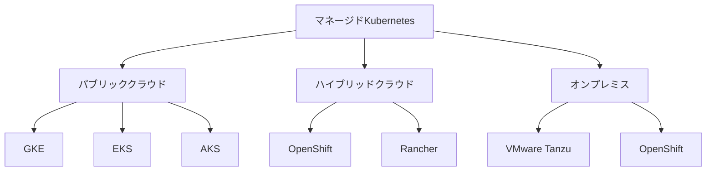

# マネージドプロバイダの選択

マネージドKubernetesサービスは、インフラストラクチャの管理からKubernetesクラスターの運用までをプロバイダが担当するサービスです。

## なぜ必要なのか

- **この機能がないとどうなるのか**
  - インフラストラクチャの構築と運用を自社で行う必要がある
  - Kubernetesクラスターのメンテナンスに多くのリソースを割く必要がある
  - 専門知識を持ったエンジニアの確保が必要

- **どのような問題が発生するのか**
  - インフラ運用の負荷が大きい
  - クラスターのアップデートやセキュリティパッチの適用が遅れる
  - スキル不足による設定ミスや運用ミスのリスク

- **どのようなメリットがあるのか**
  - インフラ運用の負荷を大幅に軽減できる
  - 最新のKubernetes機能をすぐに利用できる
  - 専門的な運用ノウハウを活用できる

## 重要なポイント

マネージドKubernetesサービスを選択する際は、既存のインフラストラクチャとの互換性、必要な機能の提供状況、コスト構造、セキュリティとコンプライアンスへの対応状況を総合的に評価する必要があります。

## 主要なマネージドプロバイダ

## 選択時の考慮ポイント

### 1. クラウドプロバイダとの互換性
- 既存のクラウドインフラストラクチャとの統合
- マルチクラウド戦略の実現可能性
- データの所在地とコンプライアンス要件

### 2. 機能と性能
- 自動スケーリング機能
- 高可用性の実現方法
- 監視とロギングの機能
- バックアップとディザスタリカバリ

### 3. コスト構造
- 基本料金と使用量に応じた課金
- リソース使用量の最適化
- 予測可能なコスト管理

### 4. セキュリティとコンプライアンス
- セキュリティ認証（ISO27001, SOC2等）
- データ暗号化
- アクセス制御とIAM
- コンプライアンス要件への対応

## セキュリティ考慮事項

- クラウドプロバイダのセキュリティ認証の確認
- データの暗号化（転送時と保存時）
- ネットワークセキュリティの設定
- アクセス制御とIAMの適切な設定
- 定期的なセキュリティ監査の実施

## 参考資料

- [マネージドKubernetesプロバイダの選択ガイド](https://kubernetes.io/docs/setup/production-environment/turnkey-solutions/)
- [AWS Elastic Kubernetes Serviceのバッチ処理対応](https://aws.amazon.com/eks/)
