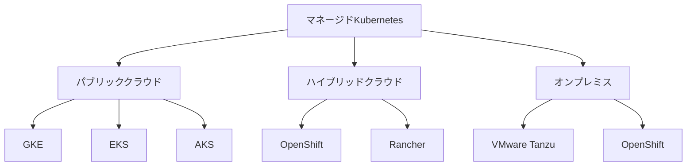

# マネージドプロバイダの選択

マネージドKubernetesサービスは、インフラストラクチャの管理からKubernetesクラスターの運用までをプロバイダが担当するサービスです。これにより、組織はアプリケーション開発に集中することができ、運用負荷を大幅に軽減できます。

## 主要概念

マネージドKubernetesサービスは、サーバー、ストレージ、ネットワークなどの基盤インフラストラクチャと、Kubernetesクラスターのインストール、設定、メンテナンスをプロバイダが管理します。ユーザーはKubernetesの機能に集中して利用できます。

## 主要なマネージドプロバイダ



## 選択時の考慮ポイント

### 1. クラウドプロバイダとの互換性
- 既存のクラウドインフラストラクチャとの統合
- マルチクラウド戦略の実現可能性
- データの所在地とコンプライアンス要件

### 2. 機能と性能
- 自動スケーリング機能
- 高可用性の実現方法
- 監視とロギングの機能
- バックアップとディザスタリカバリ

### 3. コスト構造
- 基本料金と使用量に応じた課金
- リソース使用量の最適化
- 予測可能なコスト管理

### 4. セキュリティとコンプライアンス
- セキュリティ認証（ISO27001, SOC2等）
- データ暗号化
- アクセス制御とIAM
- コンプライアンス要件への対応

## 実装例：GKEクラスターの作成

```bash
# GKEクラスターの作成
gcloud container clusters create my-cluster \
    --num-nodes=3 \
    --zone=asia-northeast1-a \
    --machine-type=e2-medium \
    --enable-autoscaling \
    --min-nodes=1 \
    --max-nodes=5
```

## セキュリティ考慮事項

- クラウドプロバイダのセキュリティ認証の確認
- データの暗号化（転送時と保存時）
- ネットワークセキュリティの設定
- アクセス制御とIAMの適切な設定
- 定期的なセキュリティ監査の実施

## 参考資料

- [マネージドKubernetesプロバイダの選択ガイド](https://kubernetes.io/docs/setup/production-environment/turnkey-solutions/)
- [AWS Elastic Kubernetes Serviceのバッチ処理対応](https://aws.amazon.com/eks/)
- [Kubernetesのための適切なプラットフォーム構築方法](https://kubernetes.io/docs/setup/production-environment/turnkey-solutions/)
