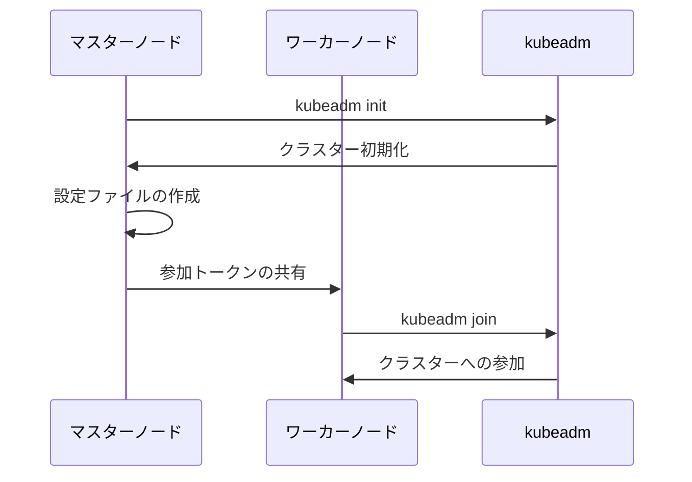

# ローカルクラスタのインストール

## はじめに

「Kubernetesを学びたいけど、クラウド環境は使いたくない...」「オフライン環境でも開発したい...」そんな悩みはありませんか？ローカル環境にKubernetesクラスターを構築することで、これらの問題を解決できます。この記事では、ローカル環境でのKubernetesクラスター構築について解説します。

## ざっくり理解しよう

ローカルKubernetesクラスターの全体像を3つのポイントで押さえましょう：

1. **開発環境の構築**: ローカルマシン上でKubernetesクラスターを構築し、開発やテストを効率的に行えます。

2. **オフライン開発**: インターネット接続なしでも開発・テストが可能で、セキュアな環境での作業ができます。

3. **コスト効率**: クラウド環境を使用せずに学習や開発ができるため、コストを抑えられます。

## 実際の使い方

### よくある使用シーン
- 開発環境の構築
- テスト環境の準備
- 学習・教育環境の構築

### メリットと注意点
- **メリット**:
  - 迅速な環境構築
  - コストの削減
  - オフライン開発が可能
- **注意点**:
  - リソース制限の考慮
  - セキュリティ設定の確認
  - バックアップの重要性

## 手を動かしてみよう

### 1. 前提条件の設定
```bash
# SELinuxの無効化
setenforce 0
sed -i 's/^SELINUX=enforcing$/SELINUX=permissive/' /etc/selinux/config

# ファイアウォールの設定
firewall-cmd --permanent --add-port=6443/tcp
firewall-cmd --permanent --add-port=2379-2380/tcp
firewall-cmd --permanent --add-port=10250/tcp
firewall-cmd --permanent --add-port=10251/tcp
firewall-cmd --permanent --add-port=10252/tcp
firewall-cmd --reload

# スワップの無効化
swapoff -a
sed -i '/swap/d' /etc/fstab
```

### 2. コンテナランタイムのインストール
```bash
# Dockerのインストール
yum install -y yum-utils
yum-config-manager --add-repo https://download.docker.com/linux/centos/docker-ce.repo
yum install -y docker-ce docker-ce-cli containerd.io
systemctl enable docker
systemctl start docker
```

### 3. Kubernetesコンポーネントのインストール
```bash
# Kubernetesリポジトリの設定
cat <<EOF > /etc/yum.repos.d/kubernetes.repo
[kubernetes]
name=Kubernetes
baseurl=https://packages.cloud.google.com/yum/repos/kubernetes-el7-x86_64
enabled=1
gpgcheck=1
repo_gpgcheck=1
gpgkey=https://packages.cloud.google.com/yum/doc/yum-key.gpg https://packages.cloud.google.com/yum/doc/rpm-package-key.gpg
EOF

# コンポーネントのインストール
yum install -y kubelet kubeadm kubectl
systemctl enable kubelet
systemctl start kubelet
```

### クラスターの初期化


## 実践的なサンプル

### 基本的な設定パターン
1. **シングルノードクラスター**
   - 開発・テスト用
   - 最小構成
   - クイックスタート

2. **マルチノードクラスター**
   - 本番環境に近い構成
   - 高可用性
   - スケーラビリティ

## 困ったときは

### よくあるトラブルと解決方法
1. **コンポーネントの起動エラー**
   - ログの確認
   - 依存関係の確認
   - 設定の見直し

2. **ネットワーク接続の問題**
   - ファイアウォール設定の確認
   - ポートの開放状態確認
   - ネットワークポリシーの確認

## もっと知りたい人へ

### 次のステップ
- クラスターの監視設定
- バックアップの設定
- セキュリティ強化

### おすすめの学習リソース
- [Kubernetes公式ドキュメント](https://kubernetes.io/docs/setup/production-environment/tools/kubeadm/)
- [Kubernetes The Hard Way](https://github.com/kelseyhightower/kubernetes-the-hard-way)
- [Kubernetes Best Practices](https://cloud.google.com/blog/products/containers-kubernetes/kubernetes-best-practices)
