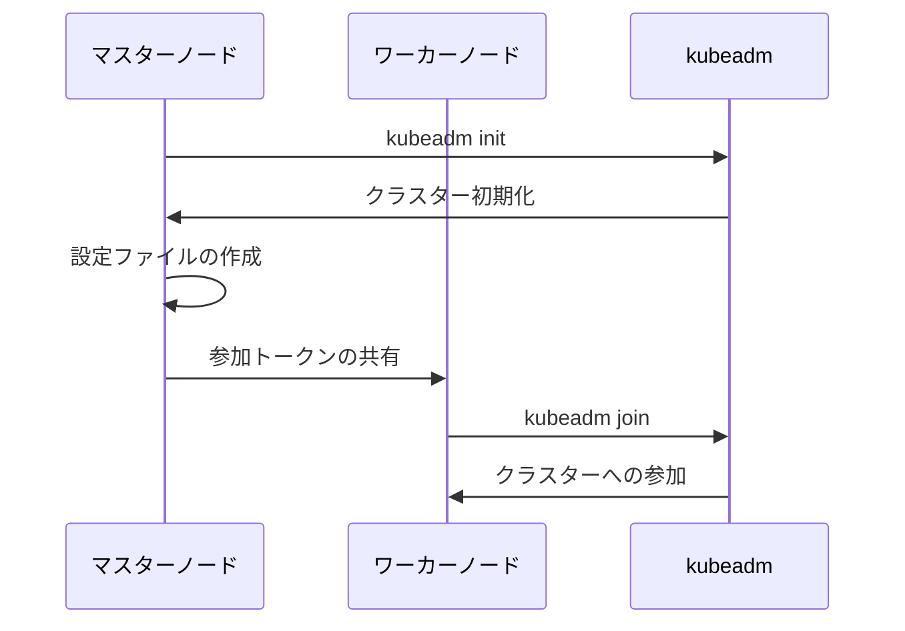

# ローカルクラスタのインストール

ローカル環境にKubernetesクラスターを構築することで、開発やテスト環境を効率的に管理できます。

## なぜ必要なのか

- **この機能がないとどうなるのか**
  - クラウド環境でテストを行う必要がある
  - 開発環境の構築に時間がかかる
  - オフライン環境での開発が難しい

- **どのような問題が発生するのか**
  - クラウド環境のコストが発生する
  - インターネット接続に依存する
  - 開発環境の再現性が低い

- **どのようなメリットがあるのか**
  - 開発環境を迅速に構築できる
  - オフライン環境でも開発可能
  - コストを抑えながら学習やテストができる

## 重要なポイント

ローカルKubernetesクラスターは、kubeadmを使用して構築することで、標準的なKubernetesの機能を利用できます。マスターノードとワーカーノードの設定、ネットワークの構成、セキュリティ設定など、本番環境に近い形で学習やテストが可能です。

## インストール手順

### 1. 前提条件の設定

```bash
# SELinuxの無効化
setenforce 0
sed -i 's/^SELINUX=enforcing$/SELINUX=permissive/' /etc/selinux/config

# ファイアウォールの設定
firewall-cmd --permanent --add-port=6443/tcp
firewall-cmd --permanent --add-port=2379-2380/tcp
firewall-cmd --permanent --add-port=10250/tcp
firewall-cmd --permanent --add-port=10251/tcp
firewall-cmd --permanent --add-port=10252/tcp
firewall-cmd --reload

# スワップの無効化
swapoff -a
sed -i '/swap/d' /etc/fstab
```

### 2. コンテナランタイムのインストール

```bash
# Dockerのインストール
yum install -y yum-utils
yum-config-manager --add-repo https://download.docker.com/linux/centos/docker-ce.repo
yum install -y docker-ce docker-ce-cli containerd.io
systemctl enable docker
systemctl start docker
```

### 3. Kubernetesコンポーネントのインストール

```bash
# Kubernetesリポジトリの設定
cat <<EOF > /etc/yum.repos.d/kubernetes.repo
[kubernetes]
name=Kubernetes
baseurl=https://packages.cloud.google.com/yum/repos/kubernetes-el7-x86_64
enabled=1
gpgcheck=1
repo_gpgcheck=1
gpgkey=https://packages.cloud.google.com/yum/doc/yum-key.gpg https://packages.cloud.google.com/yum/doc/rpm-package-key.gpg
EOF

# コンポーネントのインストール
yum install -y kubelet kubeadm kubectl
systemctl enable kubelet
systemctl start kubelet
```

## クラスターの初期化



### マスターノードの初期化

```bash
kubeadm init --pod-network-cidr=10.244.0.0/16
```

### ワーカーノードの参加

```bash
kubeadm join <マスターノードのIP>:6443 --token <トークン> --discovery-token-ca-cert-hash <ハッシュ>
```

## セキュリティ考慮事項

- 本番環境では適切な認証と認可の設定を行う
- ネットワークポリシーを設定してPod間の通信を制御
- 定期的なセキュリティアップデートの適用
- ログの監視と分析の実施

## 参考資料

- [CentOS 7でのKubernetesクラスターのインストール](https://www.tecmint.com/install-kubernetes-cluster-on-centos-7/)
- [UbuntuでのKubernetesクラスターの作成](https://www.digitalocean.com/community/tutorials/how-to-create-a-kubernetes-cluster-using-kubeadm-on-ubuntu-20-04)
