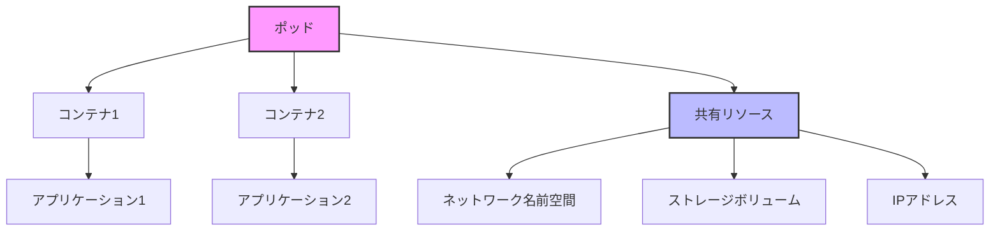

# Kubernetes: ポッド (Pod)

## 1. トピックの簡単な説明
ポッドはKubernetesクラスターにおける最小のデプロイ可能な単位であり、コンテナ化されたアプリケーションを実行・管理するための基本構成要素です。

## 2. なぜ必要なのか

### この機能がないとどうなるのか
- コンテナを個別に管理する必要があり、運用が複雑になる
- コンテナ間の通信やリソース共有が困難になる
- アプリケーションのスケーリングや更新が非効率になる

### どのような問題が発生するのか
- コンテナの依存関係管理が煩雑になる
- ネットワーク設定が複雑になる
- ストレージの共有が困難になる
- コンテナの死活監視が困難になる

### どのようなメリットがあるのか
- コンテナの論理的なグループ化が可能
- 同一ポッド内のコンテナは同じネットワーク名前空間を共有
- 同一ポッド内のコンテナは同じストレージボリュームを共有
- Kubernetesによる自動的なスケジューリングと管理

## 3. 重要なポイントの解説
ポッドは、アプリケーションの実行単位として、コンテナの論理的なグループ化とリソース共有を実現します。これにより、マイクロサービスアーキテクチャにおけるサービス間の連携や、アプリケーションのスケーリングを効率的に行うことができます。

## 4. 実際の使い方や具体例

```yaml
apiVersion: v1
kind: Pod
metadata:
  name: nginx-pod
  labels:
    app: nginx
spec:
  containers:
  - name: nginx
    image: nginx:1.14.2
    ports:
    - containerPort: 80
    resources:
      limits:
        memory: "128Mi"
        cpu: "500m"
      requests:
        memory: "64Mi"
        cpu: "250m"
```

## 5. 図解による説明



この図は、ポッド内のコンテナが共有リソース（ネットワーク名前空間、ストレージボリューム、IPアドレス）を共有している様子を示しています。これにより、同一ポッド内のコンテナは効率的に通信やリソース共有が可能になります。

## セキュリティ考慮事項
- コンテナのリソース制限を適切に設定する
- 必要最小限の権限でコンテナを実行する
- セキュリティコンテキストを適切に設定する
- ネットワークポリシーで通信を制限する

## 参考資料
- [Kubernetes公式ドキュメント: Pods](https://kubernetes.io/docs/concepts/workloads/pods/)
- [Kubernetes Best Practices: Pod Security](https://kubernetes.io/docs/concepts/security/pod-security-standards/)
