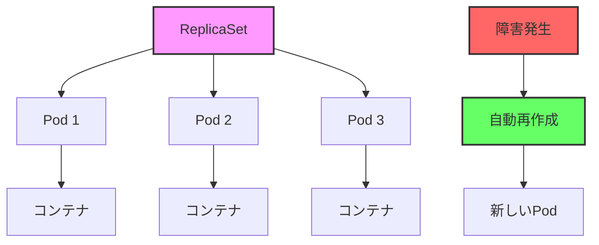

# Kubernetes: ReplicaSet

## 1. トピックの簡単な説明
ReplicaSetは、指定された数の同一のPodレプリカを常に維持し、アプリケーションの可用性と耐障害性を確保するKubernetesのコントローラーです。

## 2. なぜ必要なのか

### この機能がないとどうなるのか
- アプリケーションの可用性が低下する
- 障害発生時に手動でPodを再作成する必要がある
- スケーリングが手動で行う必要がある
- 負荷分散が非効率になる

### どのような問題が発生するのか
- 単一障害点が発生する
- 手動運用による人的ミスのリスクが高まる
- スケーリングの遅延によるサービス品質の低下
- 障害復旧に時間がかかる

### どのようなメリットがあるのか
- 指定した数のPodを自動的に維持
- Pod障害時の自動再作成
- 水平スケーリングの自動化
- 高可用性の実現
- 運用負荷の軽減

## 3. 重要なポイントの解説
ReplicaSetは、アプリケーションの可用性を確保するための基本的な仕組みを提供します。指定した数のPodを常に維持することで、障害発生時でもサービスを継続的に提供することができます。

## 4. 実際の使い方や具体例

```yaml
apiVersion: apps/v1
kind: ReplicaSet
metadata:
  name: nginx-replicaset
spec:
  replicas: 3
  selector:
    matchLabels:
      app: nginx
  template:
    metadata:
      labels:
        app: nginx
    spec:
      containers:
      - name: nginx
        image: nginx:1.19
        ports:
        - containerPort: 80
        resources:
          limits:
            memory: "128Mi"
            cpu: "500m"
          requests:
            memory: "64Mi"
            cpu: "250m"
```

## 5. 図解による説明



この図は、ReplicaSetが3つのPodを管理し、障害発生時に自動的に新しいPodを作成する様子を示しています。これにより、常に指定した数のPodが稼働している状態を維持できます。

## セキュリティ考慮事項
- Podのリソース制限を適切に設定する
- セキュリティコンテキストを適切に設定する
- ネットワークポリシーで通信を制限する
- 機密情報の適切な管理

## 参考資料
- [Kubernetes公式ドキュメント: ReplicaSet](https://kubernetes.io/docs/concepts/workloads/controllers/replicaset/)
- [Kubernetes Best Practices: ReplicaSet](https://kubernetes.io/docs/concepts/workloads/controllers/replicaset/#when-to-use-a-replicaset)
