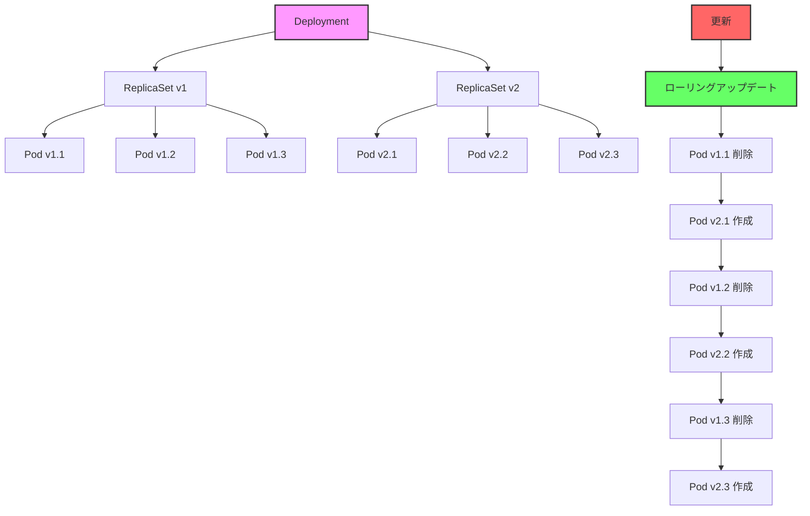

# Kubernetes: Deployment

## 1. トピックの簡単な説明
Deploymentは、アプリケーションのデプロイと更新を管理するKubernetesの中心的なリソースで、ReplicaSetを管理し、アプリケーションの無停止更新（ローリングアップデート）を実現します。

## 2. なぜ必要なのか

### この機能がないとどうなるのか
- アプリケーションの更新時にダウンタイムが発生する
- 更新失敗時のロールバックが困難になる
- 手動での更新作業が必要になる
- スケーリングと更新の管理が複雑になる

### どのような問題が発生するのか
- サービス停止によるユーザー体験の低下
- 更新作業の人的ミスのリスク
- 更新失敗時の復旧に時間がかかる
- 運用負荷の増大

### どのようなメリットがあるのか
- 無停止でのアプリケーション更新
- 自動的なロールバック機能
- 宣言的な更新管理
- スケーリングの自動化
- 更新履歴の管理

## 3. 重要なポイントの解説
Deploymentは、アプリケーションのライフサイクル管理を自動化し、信頼性の高いデプロイメントを実現します。特に、ローリングアップデートとロールバック機能により、リスクの低い更新が可能になります。

## 4. 実際の使い方や具体例

```yaml
apiVersion: apps/v1
kind: Deployment
metadata:
  name: nginx-deployment
  labels:
    app: nginx
spec:
  replicas: 3
  selector:
    matchLabels:
      app: nginx
  strategy:
    type: RollingUpdate
    rollingUpdate:
      maxSurge: 1
      maxUnavailable: 1
  template:
    metadata:
      labels:
        app: nginx
    spec:
      containers:
      - name: nginx
        image: nginx:1.14.2
        ports:
        - containerPort: 80
        resources:
          limits:
            memory: "128Mi"
            cpu: "500m"
          requests:
            memory: "64Mi"
            cpu: "250m"
```

## 5. 図解による説明



この図は、Deploymentによるローリングアップデートの様子を示しています。古いバージョンのPodを1つずつ新しいバージョンに置き換えることで、サービスを停止することなく更新を行います。

## セキュリティ考慮事項
- 適切なリソース制限の設定
- セキュリティコンテキストの設定
- ネットワークポリシーの適用
- 機密情報の適切な管理
- 更新戦略の慎重な設定

## 参考資料
- [Kubernetes公式ドキュメント: Deployment](https://kubernetes.io/docs/concepts/workloads/controllers/deployment/)
- [Kubernetes Best Practices: Deployment](https://kubernetes.io/docs/concepts/workloads/controllers/deployment/#updating-a-deployment)

## Deploymentの主な特徴

### 1. レプリカ管理
- 指定した数のPodレプリカを維持
- スケーリング（水平スケーリング）機能を提供
- Pod障害時の自動再起動

### 2. 更新戦略
- **ローリングアップデート**: デフォルトの更新戦略で、古いPodを徐々に新しいPodに置き換える
- **Recreate**: 全ての古いPodを削除してから新しいPodを作成する方法

### 3. ロールバック機能
- 問題があった場合に以前のバージョンに戻せる
- リビジョン履歴の管理

### 4. Deployment Statusの管理
- 進行中・完了・失敗などのステータス監視
- 更新の進捗確認や問題の特定

## フィールドの説明

### 1. metadata
- **name**: Deploymentの名前
- **labels**: Deploymentを識別するためのラベル

### 2. spec
- **replicas**: 作成・維持するPodの数
- **selector**: どのPodがこのDeploymentに属するかを定義するラベルセレクタ
- **strategy**: 更新戦略を指定
  - **type**: `RollingUpdate`または`Recreate`
  - **rollingUpdate**: ローリングアップデートのパラメータ
    - **maxSurge**: 指定したreplicas数を超えて作成できる新しいPodの最大数（絶対値または割合）
    - **maxUnavailable**: 更新中に利用不可になっても良いPodの最大数（絶対値または割合）
- **template**: 作成するPodのテンプレート（Pod定義と同じ構造）

## よく使うコマンド

### Deploymentの作成
```bash
kubectl apply -f deployment.yaml
```

### Deploymentの一覧表示
```bash
kubectl get deployments
```

### Deploymentの詳細表示
```bash
kubectl describe deployment <deployment-name>
```

### スケーリング
```bash
kubectl scale deployment <deployment-name> --replicas=5
```

### イメージ更新
```bash
kubectl set image deployment/<deployment-name> <container-name>=<new-image>
```

### ロールバック
```bash
kubectl rollout undo deployment/<deployment-name>
```

### 更新履歴の確認
```bash
kubectl rollout history deployment/<deployment-name>
```

### 更新状況の確認
```bash
kubectl rollout status deployment/<deployment-name>
```

## Deploymentの利用シナリオ

1. **アプリケーションの無停止更新**
   - 新バージョンへのローリングアップデート
   - 問題発生時の迅速なロールバック

2. **スケーリング**
   - トラフィック増加時の水平スケールアウト
   - リソース節約のためのスケールイン

3. **自己回復**
   - Pod障害時の自動再起動
   - ノード障害時の別ノードでのPod再作成

## Deploymentと他のリソースの関係

- **ReplicaSet**: Deploymentは内部的にReplicaSetを作成してPodのレプリカを管理
- **Pod**: ReplicaSetを通じて間接的にPodを管理
- **Service**: Deploymentが管理するPodにアクセスするためのエンドポイントを提供

## ベストプラクティス

1. **リソース制限の設定**
   - CPU/メモリの`requests`と`limits`を常に指定

2. **ヘルスチェックの設定**
   - `livenessProbe`と`readinessProbe`の適切な設定

3. **更新戦略の最適化**
   - アプリケーションに適した`maxSurge`と`maxUnavailable`の設定

4. **ラベルの適切な使用**
   - 管理しやすい一貫性のあるラベル付け

5. **アノテーションの活用**
   - 更新履歴や理由を記録するためのアノテーション追加

6. **namespace分離**
   - 環境やチームごとの適切なnamespace利用
