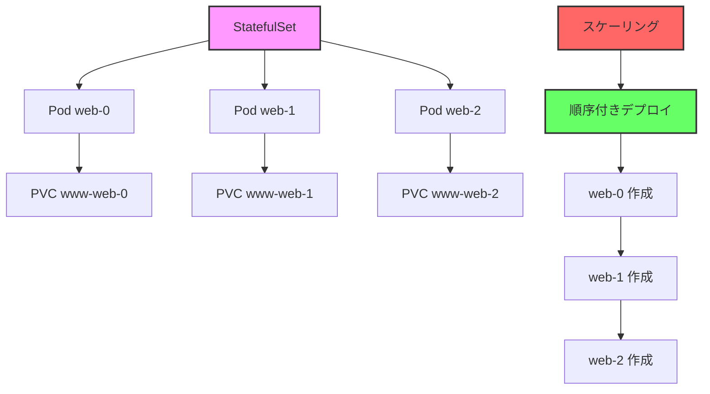

# Kubernetes: StatefulSet

## 1. トピックの簡単な説明
StatefulSetは、安定したネットワーク識別子と永続的なストレージを必要とするステートフルなアプリケーションを管理するためのコントローラーで、各Podの順序と一意性を保証します。

## 2. なぜ必要なのか

### この機能がないとどうなるのか
- データベースなどのステートフルアプリケーションの管理が困難になる
- Podの識別子が不安定になり、アプリケーションの連携が困難になる
- 永続ストレージの管理が複雑になる
- 順序付きのデプロイやスケーリングが実現できない

### どのような問題が発生するのか
- データの整合性が保てない
- アプリケーションの設定が複雑になる
- 障害復旧が困難になる
- スケーリング時のデータ管理が煩雑になる

### どのようなメリットがあるのか
- 安定したネットワーク識別子（DNS名）の提供
- 永続ストレージの自動管理
- 順序付きのデプロイとスケーリング
- アプリケーションの一貫性の確保
- 障害復旧の自動化

## 3. 重要なポイントの解説
StatefulSetは、データベースやメッセージキューなどのステートフルアプリケーションをKubernetes上で安全に運用するために必要な機能を提供します。特に、Podの識別子の安定性と永続ストレージの管理が重要なポイントです。

## 4. 実際の使い方や具体例

```yaml
apiVersion: apps/v1
kind: StatefulSet
metadata:
  name: web
spec:
  serviceName: "nginx"
  replicas: 3
  selector:
    matchLabels:
      app: nginx
  template:
    metadata:
      labels:
        app: nginx
    spec:
      containers:
      - name: nginx
        image: nginx:1.21
        ports:
        - containerPort: 80
          name: web
        volumeMounts:
        - name: www
          mountPath: /usr/share/nginx/html
  volumeClaimTemplates:
  - metadata:
      name: www
    spec:
      accessModes: [ "ReadWriteOnce" ]
      resources:
        requests:
          storage: 1Gi
```

## 5. 図解による説明



この図は、StatefulSetによる順序付きのデプロイと永続ストレージの管理を示しています。各Podは一意の識別子を持ち、対応する永続ストレージと紐付けられています。

## セキュリティ考慮事項
- 永続ボリュームのアクセス制御
- ネットワークポリシーの適切な設定
- 機密情報の管理（Secrets）
- リソース制限の設定
- 定期的なバックアップの実施

## 参考資料
- [Kubernetes公式ドキュメント: StatefulSet](https://kubernetes.io/docs/concepts/workloads/controllers/statefulset/)
- [Kubernetes Best Practices: StatefulSet](https://kubernetes.io/docs/tasks/run-application/run-replicated-stateful-application/)
