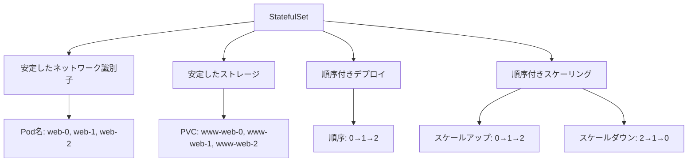

# StatefulSet

StatefulSetは、安定したネットワーク識別子と永続的なストレージを必要とするステートフルなアプリケーションを管理するためのコントローラーです。データベースなどのステートフルアプリケーションの実行に適しており、各Podの順序と一意性を保証します。

## 主要概念

StatefulSetは、以下の特徴を持つステートフルなアプリケーションの実行に適しています：
- 安定したネットワーク識別子（DNS名）
- 安定した永続ストレージ
- 順序付きのデプロイとスケーリング
- 順序付きの自動更新

## 実装例

### 基本的なStatefulSetの定義

```yaml
apiVersion: apps/v1
kind: StatefulSet
metadata:
  name: web
spec:
  serviceName: "nginx"
  replicas: 3
  selector:
    matchLabels:
      app: nginx
  template:
    metadata:
      labels:
        app: nginx
    spec:
      containers:
      - name: nginx
        image: nginx:1.21
        ports:
        - containerPort: 80
          name: web
        volumeMounts:
        - name: www
          mountPath: /usr/share/nginx/html
  volumeClaimTemplates:
  - metadata:
      name: www
    spec:
      accessModes: [ "ReadWriteOnce" ]
      resources:
        requests:
          storage: 1Gi
```

## StatefulSetの特徴



## 主なユースケース

1. データベース（MySQL, PostgreSQL, MongoDB等）
2. メッセージキュー（RabbitMQ, Kafka等）
3. キャッシュシステム（Redis等）
4. 分散ストレージシステム

## セキュリティ考慮事項

- 永続ボリュームのアクセス制御
- ネットワークポリシーの適切な設定
- 機密情報の管理（Secrets）
- リソース制限の設定
- 定期的なバックアップの実施

## 更新戦略

StatefulSetは以下の2つの更新戦略をサポートしています：

1. `RollingUpdate`（デフォルト）
   - 順序付きでPodを更新
   - 一度に1つのPodを更新
   - 更新中のPodが正常に動作するまで次のPodを更新しない

2. `OnDelete`
   - 手動でPodを削除した時のみ更新
   - より細かい制御が必要な場合に使用

## 参考資料

- [StatefulSet公式ドキュメント](https://kubernetes.io/docs/concepts/workloads/controllers/statefulset/)
- [ステートフルKubernetesアプリケーションの構築アプローチ](https://thenewstack.io/different-approaches-for-building-stateful-kubernetes-applications/)
- [Kubernetes StatefulSetチュートリアル](https://www.youtube.com/watch?v=pPQKAR1pA9U)
