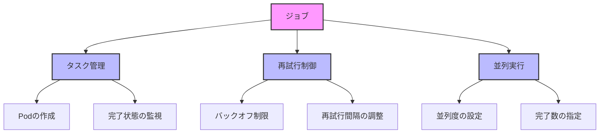

# Kubernetes: ジョブ (Job)

## 1. トピックの簡単な説明
ジョブは、有限のタスクやバッチ処理を管理するためのコントローラーで、タスクが完了すると終了します。バッチ処理、データ分析、バックアップなどの短時間実行タスクに適しています。

## 2. なぜ必要なのか

### この機能がないとどうなるのか
- バッチ処理の管理が手動になる
- タスクの再試行が手動で行う必要がある
- 並列処理の制御が困難になる
- タスクの完了状態の管理が煩雑になる

### どのような問題が発生するのか
- 人的ミスのリスクが高まる
- タスクの実行状態の把握が困難
- リソースの効率的な利用ができない
- エラー発生時の対応が遅れる

### どのようなメリットがあるのか
- タスクの自動実行と管理
- 失敗時の自動再試行
- 並列処理の制御
- リソースの効率的な利用
- タスクの完了状態の自動管理

## 3. 重要なポイントの解説
ジョブは、Kubernetesクラスター上でバッチ処理を効率的に実行するための仕組みを提供します。特に、タスクの再試行制御と並列処理の管理が重要なポイントです。

## 4. 実際の使い方や具体例

```yaml
apiVersion: batch/v1
kind: Job
metadata:
  name: pi
spec:
  template:
    spec:
      containers:
      - name: pi
        image: perl:5.34.0
        command: ["perl",  "-Mbignum=bpi", "-wle", "print bpi(2000)"]
        resources:
          limits:
            memory: "128Mi"
            cpu: "500m"
          requests:
            memory: "64Mi"
            cpu: "250m"
      restartPolicy: Never
  backoffLimit: 4
```

## 5. 図解による説明



この図は、ジョブの主要な機能（タスク管理、再試行制御、並列実行）とその動作を示しています。ジョブはこれらの機能を組み合わせて、バッチ処理を効率的に実行します。

## セキュリティ考慮事項
- ジョブの実行権限の適切な設定
- 機密情報の管理（Secrets）
- リソース制限の設定
- ネットワークアクセスの制御
- ログの監視と分析

## 参考資料
- [Kubernetes公式ドキュメント: Jobs](https://kubernetes.io/docs/concepts/workloads/controllers/job/)
- [Kubernetes Best Practices: Jobs](https://kubernetes.io/docs/tasks/job/parallel-processing-expansion/)
