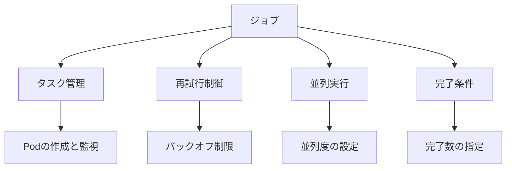

# ジョブ

ジョブは、有限のタスクやバッチ処理を管理するためのコントローラーです。バッチ処理、データ分析、バックアップなどの短時間実行タスクに適しており、タスクが完了すると終了します。ジョブは1つ以上のPodを作成してタスクを実行し、各Podの完了状態を監視します。

## 主要概念

ジョブは以下の特徴を持つタスクの実行に適しています：
- 有限のタスク実行
- 自動的な再試行
- 並列実行のサポート
- 完了条件の指定
- 失敗時の処理制御

## 実装例

### 基本的なジョブの定義

```yaml
apiVersion: batch/v1
kind: Job
metadata:
  name: pi
spec:
  template:
    spec:
      containers:
      - name: pi
        image: perl:5.34.0
        command: ["perl",  "-Mbignum=bpi", "-wle", "print bpi(2000)"]
      restartPolicy: Never
  backoffLimit: 4
```

### 並列実行ジョブの例

```yaml
apiVersion: batch/v1
kind: Job
metadata:
  name: parallel-job
spec:
  parallelism: 3
  completions: 6
  template:
    spec:
      containers:
      - name: worker
        image: busybox
        command: ["sh", "-c", "echo Processing item $ITEM && sleep 5"]
        env:
        - name: ITEM
          value: "$(JOB_COMPLETION_INDEX)"
      restartPolicy: Never
```

## ジョブの特徴



## 主なユースケース

1. バッチ処理
   - データ変換
   - レポート生成
   - バックアップ処理

2. データ分析
   - ログ分析
   - 統計処理
   - 機械学習の推論

3. システムメンテナンス
   - データベースの最適化
   - キャッシュのクリア
   - 一時ファイルの削除

## セキュリティ考慮事項

- ジョブの実行権限の適切な設定
- 機密情報の管理（Secrets）
- リソース制限の設定
- ネットワークアクセスの制御
- ログの監視と分析

## 失敗時の処理

ジョブは以下の方法で失敗を処理します：

1. バックオフ制限
   - `backoffLimit`で再試行回数を制御
   - 指数バックオフで再試行間隔を調整

2. 失敗ポリシー
   - `restartPolicy`で再起動ポリシーを指定
   - `Never`: 再起動しない
   - `OnFailure`: 失敗時のみ再起動

## 参考資料

- [ジョブ公式ドキュメント](https://kubernetes.io/docs/concepts/workloads/controllers/job/)
- [Kubernetesのユニバーサルスケジューラーへの変革](https://thenewstack.io/how-kubernetes-is-transforming-into-a-universal-scheduler/)
- [Kubernetesジョブチュートリアル](https://www.youtube.com/watch?v=j1EnBbxSz64)
