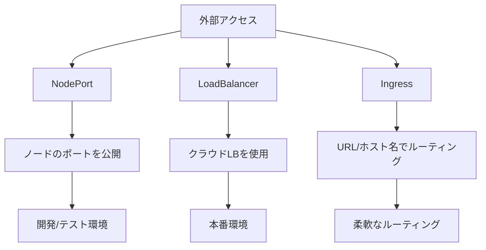

# 外部サービスへのアクセス

Kubernetesクラスター内のサービスに外部からアクセスする方法は複数あり、それぞれのユースケースに応じて適切な方法を選択できます。主な方法として、NodePort、LoadBalancer、Ingressがあります。特にIngressは、URLやホスト名に基づいてトラフィックをルーティングする柔軟な方法を提供します。

## 主要概念

外部アクセスの主な方法：

1. NodePort
   - ノードの特定のポートを公開
   - クラスター内の任意のノードからアクセス可能
   - 開発環境やテスト環境に適している

2. LoadBalancer
   - クラウドプロバイダのロードバランサーを使用
   - 自動的に外部IPアドレスを割り当て
   - 本番環境に適している

3. Ingress
   - URLパスやホスト名に基づくルーティング
   - SSL/TLS終端
   - ドメイン名ベースの仮想ホスティング

## 実装例

### NodePortの例

```yaml
apiVersion: v1
kind: Service
metadata:
  name: my-service
spec:
  type: NodePort
  selector:
    app: my-app
  ports:
    - port: 80
      targetPort: 8080
      nodePort: 30000
```

### LoadBalancerの例

```yaml
apiVersion: v1
kind: Service
metadata:
  name: my-service
spec:
  type: LoadBalancer
  selector:
    app: my-app
  ports:
    - port: 80
      targetPort: 8080
```

### Ingressの例

```yaml
apiVersion: networking.k8s.io/v1
kind: Ingress
metadata:
  name: my-ingress
spec:
  rules:
  - host: myapp.example.com
    http:
      paths:
      - path: /
        pathType: Prefix
        backend:
          service:
            name: my-service
            port:
              number: 80
```

## 外部アクセスの特徴



## セキュリティ考慮事項

- 必要最小限のポートのみを公開
- 適切なネットワークポリシーの設定
- SSL/TLSの適切な設定
- アクセス制御の実装
- 定期的なセキュリティ監査

## 主なユースケース

1. 開発環境
   - NodePortを使用した簡易的なアクセス
   - ローカル開発環境でのテスト

2. 本番環境
   - LoadBalancerによる高可用性
   - Ingressによる柔軟なルーティング
   - ドメイン名ベースのアクセス制御

3. マルチテナント環境
   - 名前空間ごとの分離
   - ドメイン名によるテナント分離
   - リソース制限の設定

## 参考資料

- [Ingress公式ドキュメント](https://kubernetes.io/docs/concepts/services-networking/ingress/)
- [Kubernetes Ingress入門](https://thenewstack.io/kubernetes-ingress-for-beginners/)
- [Kubernetesサービスへの外部アクセス方法](https://www.youtube.com/watch?v=iBYTFpoXx24)
