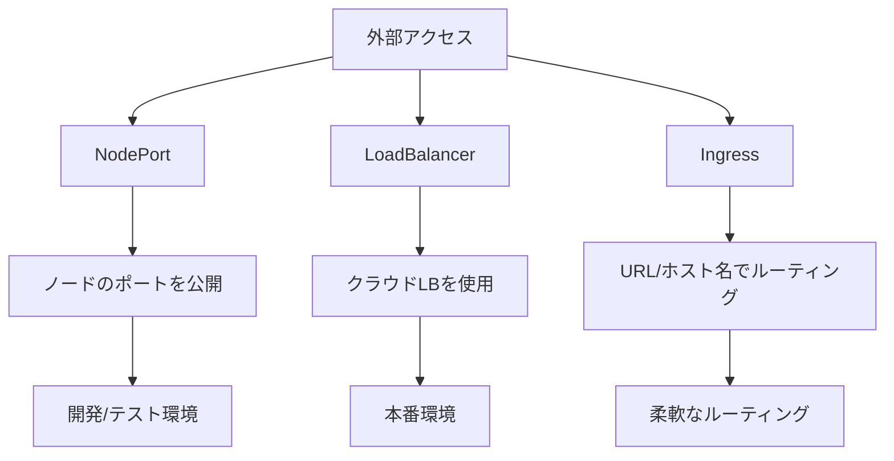

# 外部サービスへのアクセス

## 概要
Kubernetesクラスター内のサービスに外部からアクセスする方法は複数あり、それぞれのユースケースに応じて適切な方法を選択できます。

## なぜ必要なのか

### この機能がないとどうなるのか
- クラスター内のアプリケーションに外部からアクセスできない
- ユーザーがサービスを利用できない
- システム間の連携が困難になる

### どのような問題が発生するのか
- アプリケーションの公開ができない
- 外部システムとの連携ができない
- ユーザーアクセスが制限される

### どのようなメリットがあるのか
- 柔軟なアクセス制御が可能
- セキュアな外部公開が実現
- スケーラブルなサービス提供が可能

## 重要なポイント

外部アクセスの主な方法は3つあり、それぞれの特徴を理解して適切に選択することが重要です：

1. NodePort: 開発環境やテスト環境に適した簡易的な方法
2. LoadBalancer: 本番環境での高可用性を実現する方法
3. Ingress: URLやホスト名に基づく柔軟なルーティングを実現する方法

## 実際の使い方

### NodePortの例
```yaml
apiVersion: v1
kind: Service
metadata:
  name: my-service
spec:
  type: NodePort
  selector:
    app: my-app
  ports:
    - port: 80
      targetPort: 8080
      nodePort: 30000
```

### LoadBalancerの例
```yaml
apiVersion: v1
kind: Service
metadata:
  name: my-service
spec:
  type: LoadBalancer
  selector:
    app: my-app
  ports:
    - port: 80
      targetPort: 8080
```

### Ingressの例
```yaml
apiVersion: networking.k8s.io/v1
kind: Ingress
metadata:
  name: my-ingress
spec:
  rules:
  - host: myapp.example.com
    http:
      paths:
      - path: /
        pathType: Prefix
        backend:
          service:
            name: my-service
            port:
              number: 80
```

## 図解による説明



## セキュリティ考慮事項

- 必要最小限のポートのみを公開
- 適切なネットワークポリシーの設定
- SSL/TLSの適切な設定
- アクセス制御の実装
- 定期的なセキュリティ監査

## 参考資料

- [Ingress公式ドキュメント](https://kubernetes.io/docs/concepts/services-networking/ingress/)
- [Kubernetes Ingress入門](https://thenewstack.io/kubernetes-ingress-for-beginners/)
- [Kubernetesサービスへの外部アクセス方法](https://www.youtube.com/watch?v=iBYTFpoXx24)
