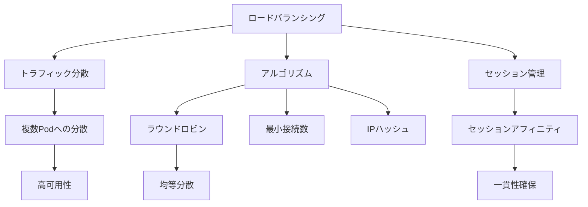

# ロードバランシング

## 概要
Kubernetesのロードバランシングは、Serviceオブジェクトを使用して複数のPodやノードにネットワークトラフィックを分散させる仕組みです。

## なぜ必要なのか

### この機能がないとどうなるのか
- 特定のPodに負荷が集中する
- システムの可用性が低下する
- スケーラビリティが制限される

### どのような問題が発生するのか
- パフォーマンスの低下
- サービス停止のリスク
- リソースの非効率な利用

### どのようなメリットがあるのか
- 高可用性の実現
- 効率的なリソース利用
- スムーズなスケーリング

## 重要なポイント

ロードバランシングの主な特徴は以下の3つです：

1. トラフィック分散: 複数のPodへの均等な負荷分散
2. アルゴリズム: ラウンドロビン、最小接続数、IPハッシュなど
3. セッションアフィニティ: クライアントIPベース、クッキーベースの制御

## 実際の使い方

### 基本的なServiceの定義
```yaml
apiVersion: v1
kind: Service
metadata:
  name: my-service
spec:
  selector:
    app: my-app
  ports:
    - protocol: TCP
      port: 80
      targetPort: 8080
  type: ClusterIP
```

### セッションアフィニティの設定
```yaml
apiVersion: v1
kind: Service
metadata:
  name: my-service
spec:
  selector:
    app: my-app
  ports:
    - protocol: TCP
      port: 80
      targetPort: 8080
  sessionAffinity: ClientIP
  sessionAffinityConfig:
    clientIP:
      timeoutSeconds: 10800
```

## 図解による説明



## セキュリティ考慮事項

- 適切なネットワークポリシーの設定
- ヘルスチェックの実装
- リソース制限の設定
- アクセス制御の実装
- 監視とログ記録

## 参考資料

- [Ingressロードバランシング公式ドキュメント](https://kubernetes.io/docs/concepts/services-networking/ingress/#load-balancing)
- [Ingressコントローラー：Kubernetesの万能ツール](https://thenewstack.io/ingress-controllers-the-swiss-army-knife-of-kubernetes/)
- [Kubernetesのロードバランシングサービスチュートリアル](https://www.youtube.com/watch?v=xCsz9IOt-fs)
