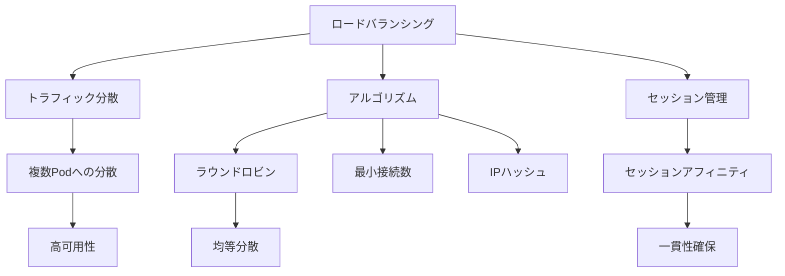

# ロードバランシング

Kubernetesのロードバランシングは、Serviceオブジェクトを使用して複数のPodやノードにネットワークトラフィックを分散させる仕組みです。Serviceは一連のPodに対して安定したネットワークエンドポイントを提供し、単一のIPアドレスとDNS名を通じてアクセスを可能にします。

## 主要概念

ロードバランシングの主な特徴：

1. トラフィック分散
   - 複数のPodへの均等な負荷分散
   - 高可用性の確保
   - スケーラビリティの向上

2. アルゴリズム
   - ラウンドロビン（デフォルト）
   - 最小接続数
   - IPハッシュ

3. セッションアフィニティ
   - クライアントIPベース
   - クッキーベース
   - カスタムルール

## 実装例

### 基本的なServiceの定義

```yaml
apiVersion: v1
kind: Service
metadata:
  name: my-service
spec:
  selector:
    app: my-app
  ports:
    - protocol: TCP
      port: 80
      targetPort: 8080
  type: ClusterIP
```

### セッションアフィニティの設定

```yaml
apiVersion: v1
kind: Service
metadata:
  name: my-service
spec:
  selector:
    app: my-app
  ports:
    - protocol: TCP
      port: 80
      targetPort: 8080
  sessionAffinity: ClientIP
  sessionAffinityConfig:
    clientIP:
      timeoutSeconds: 10800
```

## ロードバランシングの特徴



## セキュリティ考慮事項

- 適切なネットワークポリシーの設定
- ヘルスチェックの実装
- リソース制限の設定
- アクセス制御の実装
- 監視とログ記録

## 主なユースケース

1. ウェブアプリケーション
   - HTTP/HTTPSトラフィックの分散
   - セッション管理
   - SSL終端

2. マイクロサービス
   - サービス間通信
   - 内部ロードバランシング
   - サービスディスカバリ

3. バッチ処理
   - ジョブの分散実行
   - リソースの効率的な利用
   - スケーリング

## 参考資料

- [Ingressロードバランシング公式ドキュメント](https://kubernetes.io/docs/concepts/services-networking/ingress/#load-balancing)
- [Ingressコントローラー：Kubernetesの万能ツール](https://thenewstack.io/ingress-controllers-the-swiss-army-knife-of-kubernetes/)
- [Kubernetesのロードバランシングサービスチュートリアル](https://www.youtube.com/watch?v=xCsz9IOt-fs)
