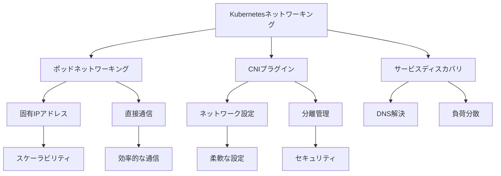

# ネットワーキングとポッド間通信

Kubernetesクラスター内でのポッド間通信は、アプリケーションの連携とスケーラビリティを実現する上で重要な要素です。各ポッドには固有のIPアドレスが割り当てられ、コンテナネットワークインターフェース（CNI）プラグインによってネットワークの設定と分離が管理されます。

## 主要概念

Kubernetesのネットワーキングの基本原則：

1. ポッドネットワーキング
   - 各ポッドに固有のIPアドレス
   - ポッド間の直接通信
   - NAT不要の通信

2. CNIプラグイン
   - ネットワークインターフェースの設定
   - ポッド間の分離
   - ネットワークポリシーの実装

3. サービスディスカバリ
   - DNSベースの名前解決
   - サービスエンドポイントの管理
   - 負荷分散

## 実装例

### 基本的なネットワークポリシー

```yaml
apiVersion: networking.k8s.io/v1
kind: NetworkPolicy
metadata:
  name: test-network-policy
  namespace: default
spec:
  podSelector:
    matchLabels:
      role: db
  policyTypes:
  - Ingress
  - Egress
  ingress:
  - from:
    - podSelector:
        matchLabels:
          role: frontend
    ports:
    - protocol: TCP
      port: 6379
```

### ポッド間通信の設定

```yaml
apiVersion: v1
kind: Pod
metadata:
  name: pod-1
  labels:
    app: myapp
spec:
  containers:
  - name: container-1
    image: nginx
    ports:
    - containerPort: 80
---
apiVersion: v1
kind: Pod
metadata:
  name: pod-2
  labels:
    app: myapp
spec:
  containers:
  - name: container-2
    image: nginx
    ports:
    - containerPort: 80
```

## ネットワーキングの特徴



## セキュリティ考慮事項

- ネットワークポリシーの適切な設定
- ポッド間通信の制限
- セキュリティコンテキストの設定
- トラフィックの暗号化
- アクセス制御の実装

## 主なユースケース

1. マイクロサービスアーキテクチャ
   - サービス間通信
   - サービスディスカバリ
   - 負荷分散

2. マルチテナント環境
   - テナント間の分離
   - リソースの制限
   - アクセス制御

3. ハイブリッドクラウド
   - クラウド間通信
   - ネットワークポリシー
   - セキュリティ設定

## 参考資料

- [クラスターネットワーキング公式ドキュメント](https://kubernetes.io/docs/concepts/cluster-administration/networking/)
- [ポッド間通信を使用するジョブ](https://kubernetes.io/docs/tasks/job/job-with-pod-to-pod-communication/)
- [Kubernetesのネットワーキングとストレージ](https://thenewstack.io/how-kubernetes-provides-networking-and-storage-to-applications/)
- [ネットワーキングに関する最新情報](https://app.daily.dev/tags/networking?ref=roadmapsh)
