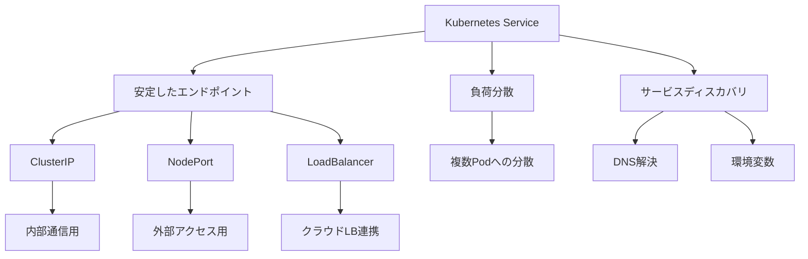

# Kubernetesサービス

## 公式ドキュメント

https://kubernetes.io/docs/concepts/services-networking/service/

## 概要

Kubernetesサービスは、Podのグループに対する単一のネットワークエンドポイントを提供し、クラスター内外からのアクセスを可能にする仕組みです。

## なぜ必要なのか

### この機能がないとどうなるのか
- PodのIPアドレスが動的に変更されるため、安定したアクセスができない
- 複数のPodへの負荷分散ができない
- サービスディスカバリが困難になる

### どのような問題が発生するのか
- アプリケーションの可用性が低下する
- スケーリングが困難になる
- サービス間の連携が複雑になる

### どのようなメリットがあるのか
- 安定したネットワークエンドポイントの提供
- 自動的な負荷分散
- サービスディスカバリの簡素化

## 重要なポイント

サービスの主な特徴は以下の3つです：

1. 安定したIPアドレスとDNS名の提供
2. 複数のPodへの負荷分散
3. サービスディスカバリの実現

## 実際の使い方

### 基本的なサービスの定義
```yaml
apiVersion: v1
kind: Service
metadata:
  name: my-service
spec:
  selector:
    app: my-app
  ports:
    - port: 80      # サービスが公開するポート
      targetPort: 8080  # Podの待ち受けポート
  type: ClusterIP  # サービスタイプ（省略可）
```

### サービスのデバッグ方法
```bash
# サービスの詳細確認
kubectl describe service my-service

# エンドポイントの確認
kubectl get endpoints my-service

# サービスへの接続テスト
kubectl run test-pod --image=busybox -it --rm -- wget -O- my-service:80
```

## 図解による説明



## セキュリティ考慮事項

- 適切なネットワークポリシーの設定
- サービス間のアクセス制御
- セキュリティコンテキストの設定
- トラフィックの暗号化
- 定期的なセキュリティ監査

## 参考資料

- [Kubernetes Service公式ドキュメント](https://kubernetes.io/docs/concepts/services-networking/service/)
- [Kubernetes Service入門](https://thenewstack.io/kubernetes-services-for-beginners/)
- [Kubernetes Serviceチュートリアル](https://www.youtube.com/watch?v=1oPHYtQnwz4)

## 主要概念

サービスは、一連のPodを抽象化し、それらに対する安定したIPアドレスやDNS名を提供することで、動的に変化するPodへのアクセスを安定させます。

## サービスの種類

### ClusterIP（デフォルト）
- クラスター内部からのみアクセス可能
- クラスター内の他のPodからのアクセスに使用
- 内部通信用の標準的なサービスタイプ

### NodePort
- 各ノードの特定ポートを公開
- クラスター外部からノードのIPアドレスとポート番号でアクセス可能
- ポート範囲は通常30000-32767

### LoadBalancer
- クラウドプロバイダーのロードバランサーを作成
- 外部からのアクセスに使用
- AWS ELBやGCP Load Balancerなどと連携

### ExternalName
- 外部サービスへのエイリアスを作成
- クラスター内からの外部サービスへのアクセスを簡素化

## サービスの定義例

```yaml
apiVersion: v1
kind: Service
metadata:
  name: my-service
spec:
  selector:
    app: my-app
  ports:
    - port: 80      # サービスが公開するポート
      targetPort: 8080  # Podの待ち受けポート
  type: ClusterIP  # サービスタイプ（省略可）
```

## サービスディスカバリー

Kubernetesには2つの主要なサービスディスカバリーの仕組みがあります：

1. **環境変数**: Podが起動すると、既存のサービスの情報が環境変数として注入されます
2. **DNS**: クラスター内のDNSサーバーにより、サービス名をIPアドレスに解決できます

## サービスとエンドポイント

- サービスは実際にはPodに直接接続せず、Endpointsリソースを通じて接続します
- Endpointsはサービスのセレクタに一致するPodのIPアドレスとポートのリストを保持
- 手動でEndpointsを管理することで、外部サービスへの接続も可能
