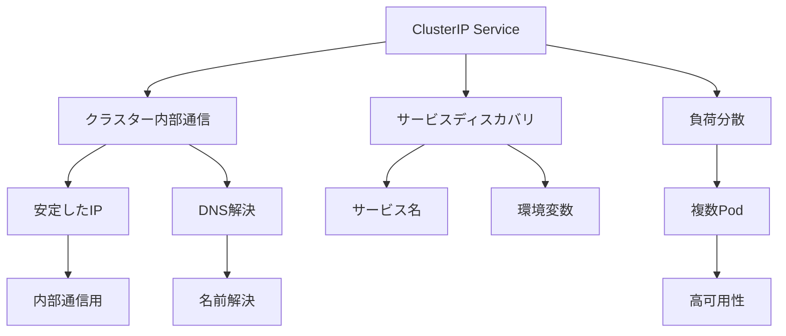

# Kubernetes ClusterIP Service

## 概要
ClusterIP Serviceは、Kubernetesクラスター内のアプリケーション間通信を実現する基本的なサービスタイプです。

## なぜ必要なのか

### この機能がないとどうなるのか
- クラスター内のアプリケーション間で通信ができない
- サービスディスカバリが困難になる
- 内部通信用の安定したエンドポイントが提供できない

### どのような問題が発生するのか
- マイクロサービス間の連携ができない
- バックエンドサービスへのアクセスが不安定
- システムの可用性が低下する

### どのようなメリットがあるのか
- クラスター内での安定した通信が可能
- サービスディスカバリの簡素化
- 内部通信用のセキュアな環境を提供

## 重要なポイント

ClusterIP Serviceの主な特徴は以下の3つです：

1. クラスター内部でのみ利用可能
2. 静的なIPアドレスを提供
3. サービス名によるDNS解決が可能

## 実際の使い方

### 基本的なClusterIP Serviceの定義
```yaml
apiVersion: v1
kind: Service
metadata:
  name: my-service
spec:
  selector:
    app: MyApp
  ports:
    - protocol: TCP
      port: 80        # サービスが公開するポート
      targetPort: 9376 # Podのターゲットポート
  type: ClusterIP      # デフォルトはClusterIP
```

### セッションアフィニティの設定
```yaml
spec:
  sessionAffinity: ClientIP
  sessionAffinityConfig:
    clientIP:
      timeoutSeconds: 10800
```

## 図解による説明



## セキュリティ考慮事項

- ネットワークポリシーの適切な設定
- サービス間のアクセス制御
- セキュリティコンテキストの設定
- トラフィックの暗号化
- 定期的なセキュリティ監査

## 参考資料

- [Kubernetes Service公式ドキュメント](https://kubernetes.io/docs/concepts/services-networking/service/)
- [ClusterIP Service入門](https://thenewstack.io/kubernetes-services-for-beginners/)
- [Kubernetes Serviceチュートリアル](https://www.youtube.com/watch?v=1oPHYtQnwz4)
