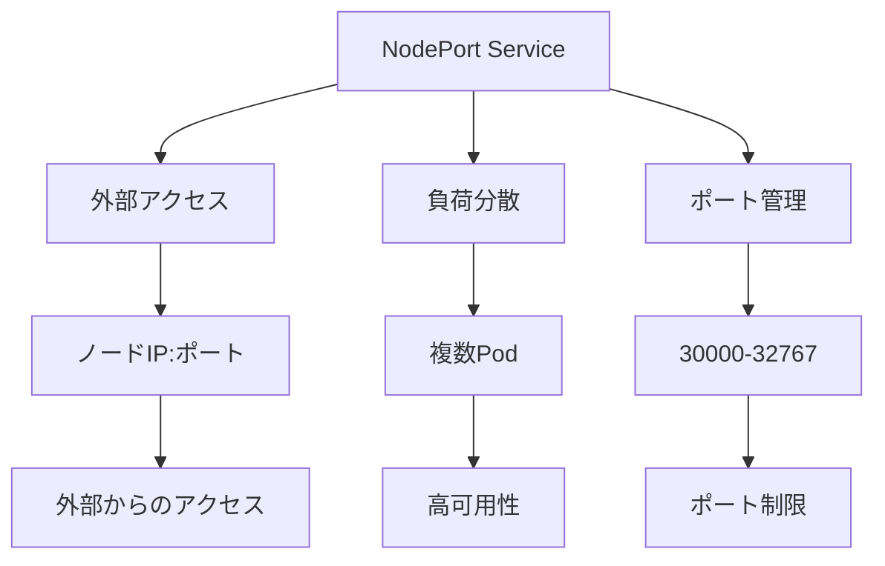

# Kubernetes NodePort Service

## 概要
NodePort Serviceは、Kubernetesクラスター内のPodをクラスター外部に公開するための最も基本的な方法です。

## なぜ必要なのか

### この機能がないとどうなるのか
- クラスター外部からアプリケーションにアクセスできない
- 開発環境でのテストが困難になる
- 外部システムとの連携ができない

### どのような問題が発生するのか
- アプリケーションの公開ができない
- 開発・テストの効率が低下する
- システム間の連携が制限される

### どのようなメリットがあるのか
- 簡単な外部アクセスの実現
- 開発環境でのテストが容易
- クラウドプロバイダーに依存しない

## 重要なポイント

NodePort Serviceの主な特徴は以下の3つです：

1. クラスター内の全ノードで特定のポートを開放
2. ポート範囲は30000-32767の間で設定
3. 開発環境やテスト環境での利用に適している

## 実際の使い方

### 基本的なNodePort Serviceの定義
```yaml
apiVersion: v1
kind: Service
metadata:
  name: my-service
spec:
  type: NodePort
  selector:
    app: my-app
  ports:
    - port: 80          # クラスター内部からアクセスするためのポート
      targetPort: 8080  # コンテナのポート
      nodePort: 30007   # 外部公開用ポート（省略可能、省略時は自動割り当て）
```

## 図解による説明



## セキュリティ考慮事項

- 必要最小限のポートのみを公開
- 適切なネットワークポリシーの設定
- アクセス制御の実装
- セキュリティコンテキストの設定
- 定期的なセキュリティ監査

## 参考資料

- [Kubernetes Service公式ドキュメント](https://kubernetes.io/docs/concepts/services-networking/service/)
- [NodePort Service入門](https://thenewstack.io/kubernetes-services-for-beginners/)
- [Kubernetes Serviceチュートリアル](https://www.youtube.com/watch?v=1oPHYtQnwz4)
